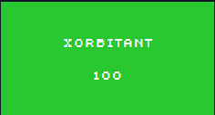

# XORbitant



**Author:** `stancium`  
**Solves:** 40

**writeup made by** `lifip27`
 ---

## Description

Let us master the primordial cryptoanalysis technique. May the first ring of crypto techniques be with you.The flag is key.

Flag format: CTF{sha256}

We get `out.bin` & `enc.py`

## Analyzing

Let's start by analysing enc.py

```python
import os

def xor(input_path: str, output_path: str):
    key = os.getenv("FLAG","CTF{example_flag}") 

    key_bytes = key.encode("utf-8")
    key_len = len(key_bytes)

    with open(input_path, "rb") as infile, open(output_path, "wb") as outfile:
        chunk_size = 4096
        i = 0
        while chunk := infile.read(chunk_size):
            xored = bytes([b ^ key_bytes[(i + j) % key_len] for j, b in enumerate(chunk)])
            outfile.write(xored)
            i += len(chunk)

xor("plaintext.txt","out.bin")
```

This is an encryption program which (after inspection) reveals the ciphertext was produced by a repeating-key XOR where the key is the flag. The flag format is `CTF{sha256}` (i.e. `CTF{` + 64 hex chars + `}`) so the key length is 69 bytes.

## The Attack

The attack is: treat the repeating-key XOR as 69 independent single-byte XOR problems (because the flag length fixes the key length to `69`). For each residue class `p = 0..68` collect the ciphertext bytes at positions `p, p+69, p+2·69, …` — each such column was XORed with the same key byte.   
 The flag format constrains every key byte to the 21 ASCII values in `b"CTF{}0123456789abcdef"`, so we bruteforce those 21 candidates per column. For each candidate key byte we XOR the column and score the resulting plaintext for “English-ness” (a fast, robust heuristic: count printable bytes, spaces and letters). Pick the key byte with the highest score for that column, assemble all 69 bytes into the key, and decrypt the whole file. Finally verify the plaintext is readable (high printable ratio) and that the recovered key matches the flag format `CTF{64hex}`.

 With that said we built `solve.py`:
 ```python
 ALLOWED = b"CTF{}0123456789abcdef"
KEY_LEN = 69  # 4 + 64 + 1

def is_printable(b: int) -> bool:
    return b in (9, 10, 13) or 32 <= b <= 126

def score_chunk(bs: bytes) -> int:
    printable = sum(1 for x in bs if is_printable(x))
    spaces = bs.count(0x20)
    letters = sum(1 for x in bs if (65 <= x <= 90) or (97 <= x <= 122))
    return printable * 3 + spaces * 2 + letters

def recover_flag(cipher: bytes) -> bytes:
    key = [None] * KEY_LEN
    known = {0: ord('C'), 1: ord('T'), 2: ord('F'), 3: ord('{'), KEY_LEN - 1: ord('}')}
    for i, v in known.items():
        key[i] = v

    for pos in range(KEY_LEN):
        if key[pos] is not None:
            continue
        col = cipher[pos::KEY_LEN]
        best = None
        for k in ALLOWED:
            dec = bytes(b ^ k for b in col)
            s = score_chunk(dec)
            if best is None or s > best[0]:
                best = (s, k)
        key[pos] = best[1]

    return bytes(key)

def decrypt(cipher: bytes, key: bytes) -> bytes:
    kl = len(key)
    return bytes(c ^ key[i % kl] for i, c in enumerate(cipher))

def main():
    # reads out.bin, runs recover_flag, decrypt, prints/writes results
    ...
```

Let's explain:
1. `ALLOWED` and `KEY_LEN`   

**What**: constants: `ALLOWED` is the set of ASCII bytes the flag characters can be (the literal bytes `C`, `T`, `F`, `{`, `}`, digits `0–9`, and lowercase hex letters `a–f`). `KEY_LEN` is set to 69 (length of `"CTF{"` + 64 hex chars + `"}"`).

**Why**: The challenge states the flag format is `CTF{sha256}` which fixes length and restricts characters. Using these constraints reduces the per-position keyspace drastically (21 candidates instead of 256), which makes brute-forcing each column trivial and reliable.

2. `is_printable(b: int) -> bool`

**What it does**: returns `True` if byte `b` is a typical printable ASCII character (space..tilde) or common whitespace characters (tab/newline/carriage return).

**Why**: When scoring candidate decryptions we prefer bytes that are printable English characters. Treating a byte as printable lets the scoring function reward candidate key bytes that yield readable text.

3. `score_chunk(bs: bytes) -> int`

**What it does**: computes a numeric score for a byte string `bs`. The implementation counts:   
    `printable`: count of printable bytes (heavy weight),   
    `spaces`: count of spaces (medium weight),   
    `letters`: count of ASCII letters (small weight),   
    then returns `printable * 3 + spaces * 2 + letters`.

4. `recover_flag(cipher: bytes) -> bytes`
   

**What it does (step-by-step)**:

Creates a `key` array of length `KEY_LEN` initialized to `None`.    
Inserts known bytes for positions where the flag format is explicit: `C`, `T`, `F`, `{`, and `}` at the last index. These are set via the `known` dict.
For each key position `pos` from `0` to `KEY_LEN-1`:
If it’s already known (from the known dict), skip.
Extracts the column `col = cipher[pos::KEY_LEN]` — all ciphertext bytes that were XORed with the same key byte.
For every candidate `k` in `ALLOWED`, decrypts the column with `k`, computes `score_chunk(dec)`, and picks the `k` with the highest score.
Returns the assembled key as bytes.

**Efficiency**: Time complexity roughly `O(KEY_LEN * |ALLOWED| * column_length)`. With `KEY_LEN=69` and `|ALLOWED|=21`, this is fast even for large ciphertexts.

5. `decrypt(cipher: bytes, key: bytes) -> bytes`

**What it does**: produces the full plaintext by XORing each ciphertext byte with the corresponding key byte (cycling through key).

**Why separate this from recover_flag**: separation of concerns — recover_flag finds the key, decrypt applies it. This makes testing and reuse cleaner (you can try different keys easily).

**Implementation detail**: uses modular indexing key[i % kl] so the key repeats across the ciphertext length.

## Solve

With every statement calculated we can build a efficient and good python script for us to get the flag!

```bash
$ python3 solve.py out.bin
flag: CTF{940a422746b832e652a991d88d31eb4d0ab2774a1f9a637e746b9226dfd44bca}
ratio: 0.994
```

### Flag: CTF{940a422746b832e652a991d88d31eb4d0ab2774a1f9a637e746b9226dfd44bca}