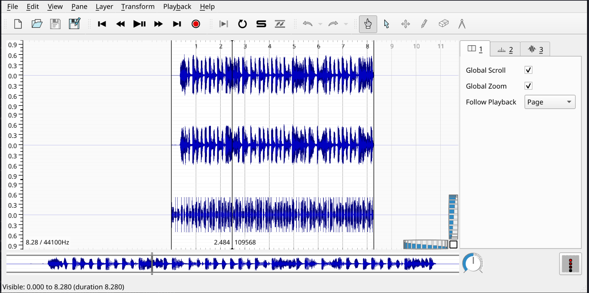
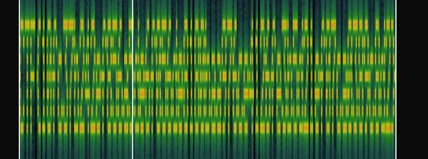

# 3rd_child

**Author:** `stancium`  
**Solves:** 38

**writeup made by** `docea007`
---

## Description

My 3rd child believes in ghosts. I don't know how to prove they aren't real.

We get `output.wav`

## Solve

Listening to the given wav file we can hear random sounds, we can open Sonic Visualizer to analize this wav file further.

First thing that comes to mind is to analyze the audio spectogram of the given audio. We can add a new spectogram layer with channel 3 from the layer dropdown menu. This gives us the spectogram.

At first this does not seem right, but we can scroll to change the frequency

This gives us the flag in a readable format which we can copy by hand.

### Flag: CTF{10fc37b242ef856a5de6f056de8180baa976ce4126fe3b5d21ef07ca0389c8d2}