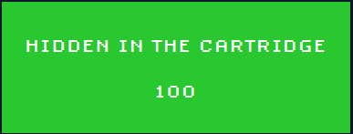

# Hidden in the Cartridge



**Author:** `AAntioch`  
**Solves:** 84

**writeup made by** `lifip27`
---

## Description

During a test session on the **Retro-Arcade emulator**, we’re given a **corrupted copy of Space Invaders**.  
The game won’t boot, but the memory logs remain inside the ROM file.  

Rumor has it the developers left hidden messages in the test cartridges. Can we recover the flag?

We get: `Hidden_in_the_Cartridge.7z`

---

## Solve

I just used strings on the file
```bash
strings strings space_invaders.nes
```
 and saw something fishy:
```bash
A[1987-06-15 10:32:01] INFO   - Booting Retro-Arcade v1.0
[1987-06-15 10:32:02] INFO   - Cartridge loaded: Space Invaders
@|.Ar
63$$$74$$$66$$$7b$$$39$$$66$$$31$$$62$$$34$$$33$$$38$$$31
...
[1987-06-15 10:32:04] INFO   - Player 1 inserted coin
[1987-06-15 10:32:07] WARN   - High score table corrupted
[1987-06-15 10:32:11] DEBUG  - Sprite cache rebuilt successfully
36$$$34$$$64$$$62$$$63$$$38$$$61$$$36$$$32$$$34$$$39$$$62
...
[1987-06-15 10:32:13] ERROR  - Controller port 2 not responding
61$$$35$$$63$$$36$$$36$$$66$$$63$$$30$$$64$$$36$$$31$$$39
-p35$$$62$$$35$$$33$$$38$$$38$$$62$$$65$$$65$$$64$$$38$$$39
...
[1987-06-15 10:32:16] DEBUG  - Secret cheat code:
 B A
[1987-06-15 10:32:19] DEBUG  - Memory dump token: 0xL0TS0FM0N3Y
30$$$36$$$38$$$30$$$62$$$66$$$36$$$31$$$36$$$30$$$32$$$31
...
[1987-06-15 10:32:22] INFO   - Emulator paused?
[1987-06-15 10:32:25] INFO   - Emulator shutdown complete??
66$$$32$$$35$$$38$$$32$$$32$$$34$$$38$$$7d"<u
```


Looking closer:

- `63` → `c`  
- `74` → `t`  
- `66` → `f`  
- `7b` → `{`  
- `7d` → `}`  

Those are clearly **hex values** spelling out the flag.

So I copied all the suspicious fragments into [**hex.txt**](hex.txt) (one block per line).  
Then I wrote a tiny [**solve.py**](solve.py) to parse the file, strip the `$$$`, concatenate everything, and decode the hex.

Running it prints the full flag:

```bash
python solve.py hex.txt
Output:
Hex string: 6374667b396631623433383136346462633861363234396261356336366663306436313935623533383862656564383930363830626636313630323166323538323234387d
Flag: ctf{9f1b438164dbc8a6249ba5c66fc0d6195b5388beed890680bf616021f2582248}

```


### Flag: ctf{9f1b438164dbc8a6249ba5c66fc0d6195b5388beed890680bf616021f2582248}

