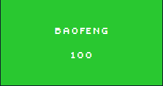
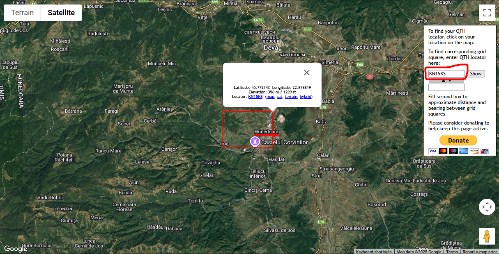

# Baofeng

**Author:** `0v3rCl0kEd`  
**Solves:** 29

**writeup made by** `lifip27`
---

## Description

Our radio monitoring agency captured a recording of someone disturbing the radio waves. Due to buget cuts there's nobody to decode the message and who he is. Please help us!

Flag format: `ctf{callsign_cityname}

Note: The callsign is not real(hopefully)

We get `call.mp3`

## Solve

Listening to the mp3 file we can hear some letters and words!

CQ CQ CQ This is Yankee Oskar 2 Tango Sierra Sierra My QTH is Kilo November 15 Kilo Sierra CQ CQ CQ This is Yankee Oskar 2 Tango Sierra Sierra

What this call was is a ham radio call sign message.

"Yankee Oskar 2 Tango Sierra Sierra" --> This is the call sign. `yo2tss`   
"My QTH is Kilo November 15 Kilo Sierra" --> This is a Maidenhead grid locator, a system ham radio operators use to give their location on Earth.   
Using this website https://k7fry.com/grid/ and entering `KN15KS`

Its from the city called `hunedoara`

### Flag: ctf{yo2tss_hunedoara}

Kudos to `0v3rCl0kEd` super cool challenge!