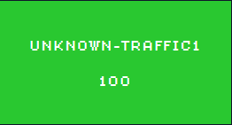
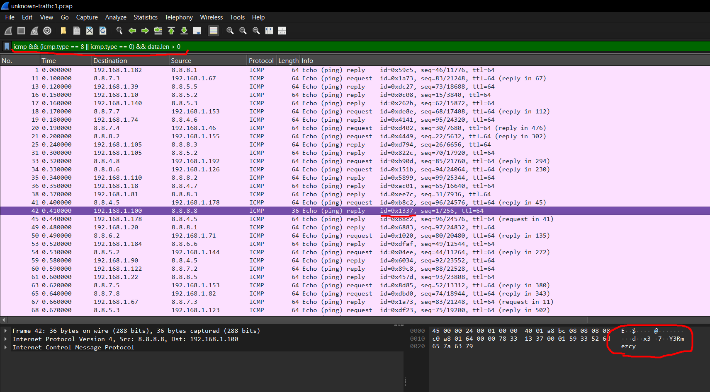

# unknown-traffic1



**Author:** `thek0der`  
**Solves:** 52

**writeup made by** `lifip27`
---
## Description

Can you find the hidden message in this pcap file?

We get: `unknown-traffic1.pcap`
---


## Solve

Analizing the packets I find some
```bash
GET /pageN.html
UDP bursts
ICMP Echo
```

The ICMP Packets we re important because:
1. this is how a ICMP Echo packet looks like

```bash
Type (1) | Code (1) | Checksum (2) | Identifier (2) | Sequence (2) | Data ...
```

For us it carried Base64 strings which we're part of the flag!

```bash
icmp && (icmp.type == 8 || icmp.type == 0) && data.len > 0
```

using this filter in wireshark and looking only with id=1337!



We can use the solve.py to automate this!

```bash
python solve.py unknown-traffic1.pcap
[+] Identifier used: 0x1
[+] Sequence → token:
      1 → ctf{72
      2 → c8c109
      3 → 0e0bba
      4 → 717671
      5 → f79de6
      6 → e941a2
      7 → 81e2f5
      8 → 1da298
      9 → 65722f
     10 → 98c9fa
     11 → 3b7160
     12 → e5}

[+] Flag:
ctf{72c8c1090e0bba717671f79de6e941a281e2f51da29865722f98c9fa3b7160e5}
```

### Flag: ctf{72c8c1090e0bba717671f79de6e941a281e2f51da29865722f98c9fa3b7160e5}