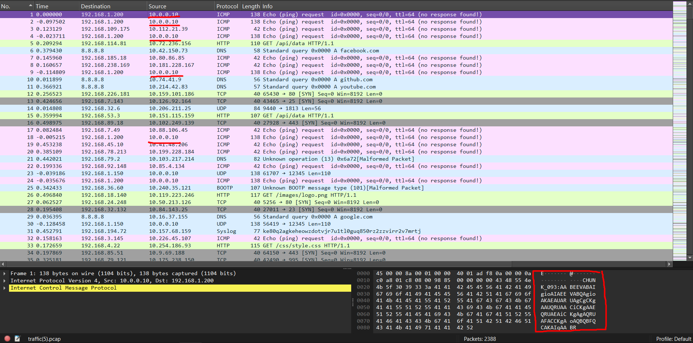
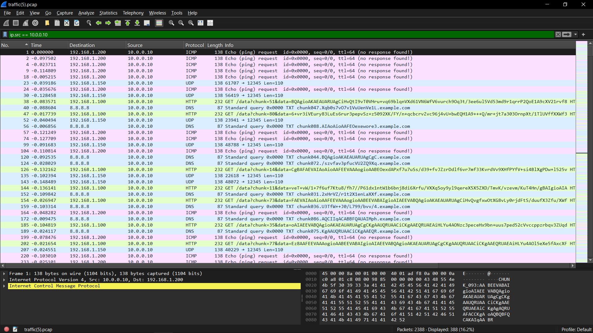
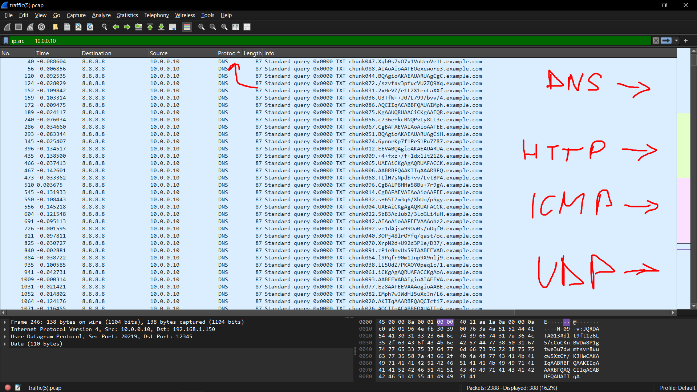

# unknown-traffic2


**Author:** `thek0der`  
**Solves:** 66

**writeup made by** `lifip27`
---

## Description

A lot more traffic just showed up on the network. Can you figure out what it is?

We get `traffic.pcap`
## Solve

Opening the pcap in wireshark!

At the start we can see that the ip `10.0.0.10` sends a lot of requests!



Inspecting the packets with the filter `ip.src == 10.0.0.10` let's us have a better look at the important traffic!



Let's extract the raw HTTP chunks strings with `tshark`!

```bash
$ tshark -r traffic.pcap -Y "http.request && ip.src==10.0.0.10" \
  -T fields -e http.request.uri > http_uris.txt
```

Viewing the txt file:

```bash
$ cat http_uris.txt
/data?chunk=51&data=BQAgioAKAEAUARUAgCiHvQtI9vT0VHru+vq69blqnVXd61VN6WfV6vurch9Oq3t/3ee6ul5Vd53md9r1qrrP2QoE1A9cXV21rvf8
/data?chunk=80&data=6+vr3iVEury83LuEs6rur3pepvSz+z5092XK/FY/n+qcbcrvZvc96j4vU+bwEQH1A9+++Q/mr+jt7a303OrnpXt/1TlUVffXXWf3
...
/data?chunk=13&data=dlt9ft1z6L5/cCoCKnBWDw8P1gtwe3u7dwmfsvr8uucw5XzCf/KJHwCAKAIqAABRBFQAAKIIqAAARBFQAQCIIqACABBFQAUAIIqA
/data?chunk=20&data=AKIIqAAARBFQAQCIcti7gA739/d7l8C/UJ3f3d1d63qrq/Zzdc5nhin9tB58zvb9x8/jn9+/9q4DTm7bttJzx+Px5LV8pLvO6nrd
/data?chunk=74&data=6ynnrKp7f1PeS1Pu7ZR71M17It/aJ3CY19fX0nOXl5et601R7Uu31efXPYfuvkw5Z1Wrz6+q+96aw2mtvr8V+MQPAEAUARUAgCgC
```

Seems kinda fishy , let's start looking at the other protocols!

We can also filter the protocols by clicking on the protocols tab above!



```bash
# UDP payloads
tshark -r traffic.pcap -Y "udp && ip.src==10.0.0.10 && udp.dstport==12345" -T fields -e data > udp_payloads.txt

# ICMP echo payloads
tshark -r traffic.pcap -Y "icmp && ip.src==10.0.0.10" -T fields -e data > icmp_payloads.txt

# DNS QNAMEs
tshark -r traffic.pcap -Y "dns && ip.src==10.0.0.10" -T fields -e dns.qry.name > dns_qnames.txt
```

By looking at them all they look like they build a PNG file, that said we can use `solve.py` to rebuild the PNG.    

```bash
$ python3 solve.py
wrote exfil.png (7226 bytes)
```

Reading the file with `zbaimg` or just a QR reader online:

```bash
$ zbarimg exfil.png
Connection Error (Failed to connect to socket /run/dbus/system_bus_socket: No such file or directory)
Connection Null
QR-Code:ctf{da8978b239f7e78370c36501ee6a0458e7c4dd870463e44ca6f9b949549ebf1b}
scanned 1 barcode symbols from 1 images in 0.15 seconds
```

### Flag: ctf{da8978b239f7e78370c36501ee6a0458e7c4dd870463e44ca6f9b949549ebf1b}


