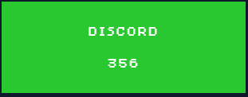

# discord

**Author:** `thek0der`  
**Solves:** 16

**writeup made by** `vlad`
---

## Description

Ah, the infamous Discord challenge. What could it be this time?

## Hint

The bot might decieve you, but he has a point. The flag is somewhere on the server, just not where you would usually think to look. Think outside the box and check EVERYTHING you can and cannot do on the server (note: open a ticket once you found the flag to actually claim it. Don't publicly post it cuz we will see it and disqualify the teams that will proceed in doing so)

---

## Solve

First i looked at the discord bot that was in the server since the hint wasn't present when i solved it and saw that the bot has 2 commands `/help` and `/flag` but they arent helpfull at all since help says `Try Harder!` and flag gives a cooking recipe.

I had a closer look in the server and found a sticker called `huh`. I sent it in a private dm and opened discord in my web browser and using inspect element i grabbed the link to the image.

`https://media.discordapp.net/stickers/1416226450729603225.webp?quality=lossless`

Zooming into the flag we see a white and black dot pattern that looks exactly like a qr code.

I could have made a script to solve it but knowing how it went in previous ctfs and since the qr was pretty readable and wasnt too big i decided to reconstruct it manually using a website which allows to draw pixels.

With a quick google search i found this website:

`https://www.pixilart.com/draw`

I opened a new canvas and the image with the sticker on my phone and in a couple of minutes i had the qr completly recreated.

I attached the file with it here.

I then used my phones camera app to scan it and got this link out of it.

`https://go.qrcode-ai.com/en/status/deactivated?type=qrcode&preview=https://cdn.qrcode-ai.com/qrcode/ffee2ee6a6062bd27dbdefa7e047e340-1757450979871.png`

At the time of writing this the link is deactivated so i cannot get the flag anymore but when it was up it would send to example.com with a query parameter with the flag it looks like a dead end first when scanned with a phone but when you click the url bar the full link including flag shows

### Flag: no flag at the time of writing