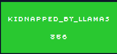
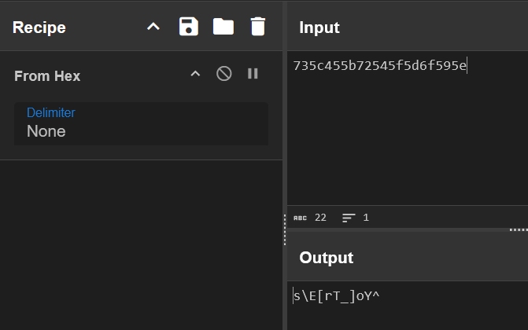
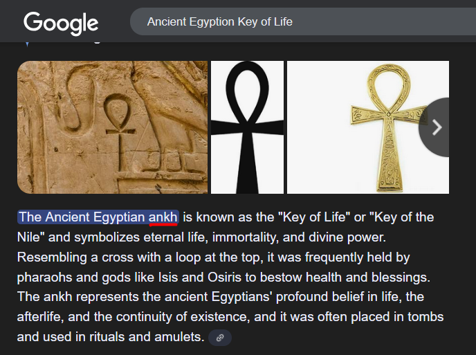
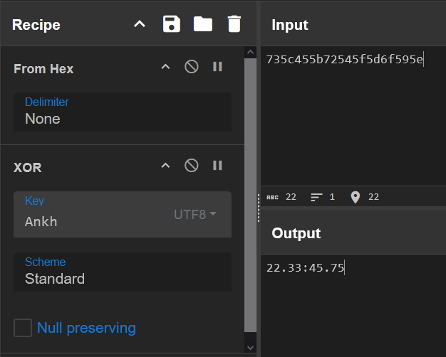

# kidnapped_by_llamas



**Author:** `iseline27424`  
**Solves:** 16

**writeup made by** `lifip27`
---

## Description

One of the last guardians of the Ancient Egyptian Key of Life has vanished. On his way to deliver its hidden power to the alpacas, disaster struck: a herd of rebel llamas rose from the shadows, and dragged him into their forbidden kingdom.

But this mage was no ordinary alpaca. To escape certain doom, he invoked the Ancient Egyptian Key of Life and wove a spell of concealment — hiding his very presence from the llamas’ gaze. Only the worthy may now find him.

The llamas prepare their ancient sacrifice… time is running out. Your mission: decipher the encrypted trail and find the mage before the kingdom’s eternal eclipse begins.

Flag format: CTF{E:N} where E and N are the coordinates in degrees with 2 decimals (truncate, don’t round).

We get `kingdom_of_llamas.jpg` (very cute photos!)

## Solve

I started by binwalking the image for hidden data!

```bash
$ binwalk kingdom_of_llamas.jpg

DECIMAL       HEXADECIMAL     DESCRIPTION
--------------------------------------------------------------------------------
0             0x0             JPEG image data, JFIF standard 1.01
30            0x1E            TIFF image data, big-endian, offset of first image directory: 8
```

Found a TIFF image data!

Using this command we can extract it!

```bash
$ dd if=kingdom_of_llamas.jpg of=hidden.tif bs=1 skip=30
594034+0 records in
594034+0 records out
594034 bytes (594 kB, 580 KiB) copied, 1.38384 s, 429 kB/s
```

After that lets extract the hidden data in the tif image!

```bash
$ exiftool hidden.tif
ExifTool Version Number         : 13.25
File Name                       : hidden.tif
Directory                       : .
...
Components Configuration        : Y, Cb, Cr, -
User Comment                    : 735c455b72545f5d6f595e
Color Space                     : Uncalibrated
```

Found `User Comment`! With the value `735c455b72545f5d6f595e`
Looks like hex!

Let's decode it in Cyberchef!



Looks pretty interesting, probably XORed with a key!  

Let's return to the description:
```md
To escape certain doom, he invoked the Ancient Egyptian Key of Life and wove a spell of concealment — hiding his very presence from the llamas’ gaze. Only the worthy may now find him.
```

`Ancient Egyption Key of Life`, hmm interesting.

With a quick search on google we can find his name!



His name is `Ankh`!

XORing it with the name we can get the coordinates!




### Flag: CTF{22.33:45.75}