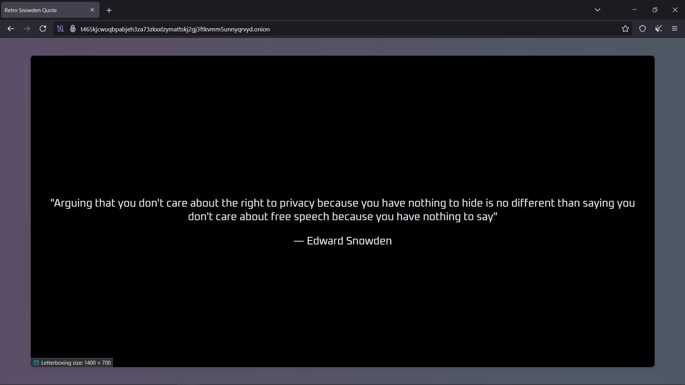
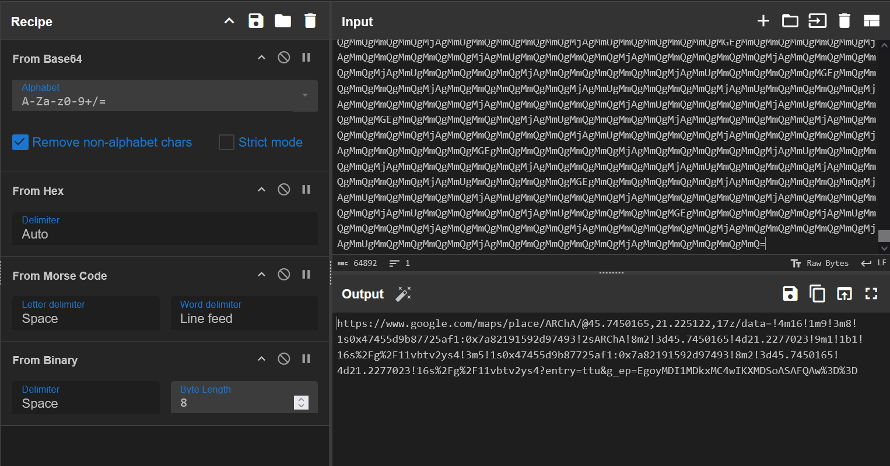
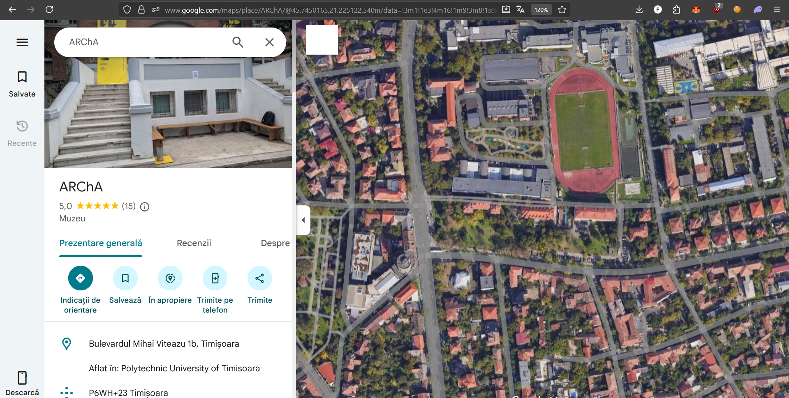
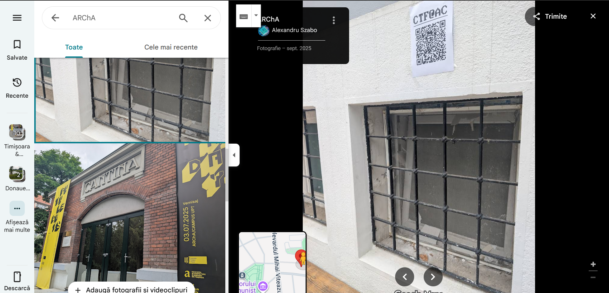
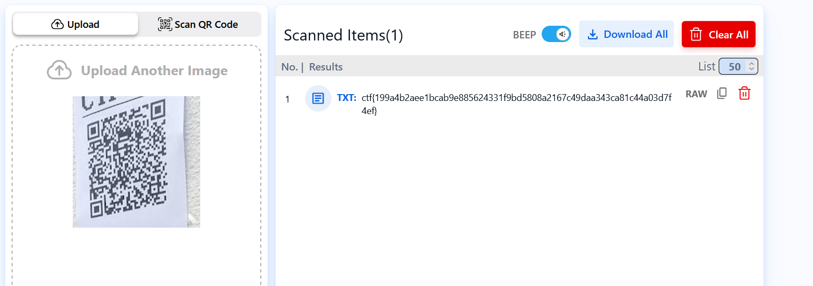

# onions2


**Author:** `thek0der`  
**Solves:** 24

**writeup made by** `lifip27`
---

## Description

This time you might cry...

We get `onion.png`


## Solve

Running zsteg on the image we get this result!
```bash
$ zsteg onion.png
b1,r,lsb,xy         .. text: "t465kjcwuqbpabjeh3za73zkxxlzymattskj2gj3ftkvmm5unnyqrvyd.onion"
b1,rgba,msb,xy      .. text: "vwvffwvffwvgfwvvvggwvgggvgfwvwvwvwvvvwfvvgfgvwffvgfvvgfgvgggvgvvvggffwfwvwggvgfvfwvwfwfwvwggvggwvwgfvwgfvgwfvwggvwgvvgwvvgfvvwvfvwvfvwfwvggwvgggfwfgvgvwvgggfwfwvgvgvwvfvggwvwvgvgwvvgwvfwvvvwvvvgwgvgw"
b1,abgr,lsb,xy      .. text: "gwgffwgffwgvfwgggvvwgvvvgvfwgwgwgwgggwfggvfvgwffgvfggvfvgvvvgvgggvvffwfwgwvvgvfgfwgwfwfwgwvvgvvwgwvfgwvfgvwfgwvvgwvggvwggvfggwgfgwgfgwfwgvvwgvvvfwfvgvgwgvvvfwfwgvgvgwgfgvvwgwgvgvwggvwgfwgggwgggvwvgvwz"
b2,rgba,msb,xy      .. text: "=???=?====??=?====??=??===??=?=?=??=?=??=??=?=?==??===??=???=???=???=?=?=???===?=??===?==???=====??====?=??===?==??=?=?==??==?=?=??=?=====??==??=????=?==??====?==??=???==??==??=????=?==??=?=??=????====????====??=??===????=?==????==?=??=??=?=??====?=???=?=="
b2,abgr,lsb,xy      .. text: ">???>?>>>>??>?>>>>??>??>>>??>?>?>??>?>??>??>?>?>>??>>>??>???>???>???>?>?>???>>>?>??>>>?>>???>>>>>??>>>>?>??>>>?>>??>?>?>>??>>?>?>??>?>>>>>??>>??>????>?>>??>>>>?>>??>???>>??>>??>????>?>>??>?>??>????>>>>????>>>>??>??>>>????>?>>????>>?>??>??>?>??>>>>?>???>?>>"
b3,rgb,msb,xy       .. file: AIX core file fulldump 64-bit
b4,bgr,msb,xy       .. file: MPEG ADTS, layer I, v2, Monaural
```

The onion website is right there! `t465kjcwuqbpabjeh3za73zkxxlzymattskj2gj3ftkvmm5unnyqrvyd.onion`

Opening the Tor Browser and looking at the page nothing looks out of the ordinary!



Inspecting the website we can see some interesting things! Like:
```html
@font-face {
            font-family: 'RetroFont';
            src: url('Oxanium-VariableFont_wght.ttf') format('truetype');
            font-weight: normal;
            font-style: normal;
        }
```

Some type of Font! Downloading it and using `strings` we can see something very fishy!

```bash
$ strings Oxanium-VariableFont_wght.ttf
pGDEF
GPOS
VGSUB
HVAR,
...
MmQgMmQgMmQgMmQgMjAgMmQgMmQgMmQgMmQgMmQgMjAgMmQgMmQgMmQgMmQgMmQgMjAgMmUgMmQgMmQgMmQgMmQgMjAgMmQgMmQgMmQgMmQgMmQgMjAgMmQgMmQgMmQgMmQgMmQgMGEgMmQgMmQgMmQgMmQgMmQgMjAgMmUgMmQgMmQgMmQgMmQgMjAgMmUgMmQgMmQgMmQgMmQgMjAgMmQgMmQgMmQgMmQgMmQgMjAgMmUgMmQgMmQgMmQgMmQgMjAgMmQgMmQgMmQgMmQgMmQgMjAgMmUgMmQgMmQgMmQgMmQgMjAgMmUgMmQgMmQgMmQgMmQgMGEgMmQgMmQgMmQgMmQgMmQgMjAgMmUgMmQgMmQgMmQgMmQgMjAgMmUgMmQgMmQgMmQgMmQgMjAgMmUgMmQgMmQgMmQgMmQgMjAgMmUgMmQgMmQgMmQgMmQgMjAgMmQgMmQgMmQgMmQgMmQgMjAgMmQgMmQgMmQgMmQgMmQgMjAgMmQgMmQgMmQgMmQgMmQgMGEgMmQgMmQgMmQgMmQgMmQgMjAgMmUgMmQgMmQgMmQgMmQgMjAgMmQgMmQgMmQgMmQgMmQgMjAgMmQgMmQgMmQgMmQgMmQgMjAgMmUgMmQgMmQgMmQgMmQgMjAgMmUgMmQgMmQgMmQgMmQgMjAgMmQgMmQgMmQgMmQgMmQgMjAgMmUgMmQgMmQgMmQgMmQgMGEgMmQgMmQgMmQgMmQgMmQgMjAgMmUgMmQgMmQgMmQgMmQgMjAgMmQgMmQgMmQgMmQgMmQgMjAgMmQgMmQgMmQgMmQgMmQgMjAgMmQgMmQgMmQgMmQgMmQgMjAgMmQgMmQgMmQgMmQgMmQgMjAgMmUgMmQgMmQgMmQgMmQgMjAgMmUgMmQgMmQgMmQgMmQgMGEgMmQgMmQgMmQgMmQgMmQgMjAgMmQgMmQgMmQgMmQgMmQgMjAgMmUgMmQgMmQgMmQgMmQgMjAgMmUgMmQgMmQgMmQgMmQgMjAgMmQgMmQgMmQgMmQgMmQgMjAgMmUgMmQgMmQgMmQgMmQgMjAgMmQgMmQgMmQgMmQgMmQgMjAgMmQgMmQgMmQgMmQgMmQgMGEgMmQgMmQgMmQgMmQgMmQgMjAgMmUgMmQgMmQgMmQgMmQgMjAgMmUgMmQgMmQgMmQgMmQgMjAgMmUgMmQgMmQgMmQgMmQgMjAgMmQgMmQgMmQgMmQgMmQgMjAgMmUgMmQgMmQgMmQgMmQgMjAgMmUgMmQgMmQgMmQgMmQgMjAgMmUgMmQgMmQgMmQgMmQgMGEgMmQgMmQgMmQgMmQgMmQgMjAgMmUgMmQgMmQgMmQgMmQgMjAgMmQgMmQgMmQgMmQgMmQgMjAgMmQgMmQgMmQgMmQgMmQgMjAgMmUgMmQgMmQgMmQgMmQgMjAgMmQgMmQgMmQgMmQgMmQgMjAgMmQgMmQgMmQgMmQgMmQgMjAgMmUgMmQgMmQgMmQgMmQgMGEgMmQgMmQgMmQgMmQgMmQgMjAgMmUgMmQgMmQgMmQgMmQgMjAgMmQgMmQgMmQgMmQgMmQgMjAgMmQgMmQgMmQgMmQgMmQgMjAgMmUgMmQgMmQgMmQgMmQgMjAgMmQgMmQgMmQgMmQgMmQgMjAgMmUgMmQgMmQgMmQgMmQgMjAgMmUgMmQgMmQgMmQgMmQgMGEgMmQgMmQgMmQgMmQgMmQgMjAgMmUgMmQgMmQgMmQgMmQgMjAgMmQgMmQgMmQgMmQgMmQgMjAgMmUgMmQgMmQgMmQgMmQgMjAgMmUgMmQgMmQgMmQgMmQgMjAgMmQgMmQgMmQgMmQgMmQgMjAgMmQgMmQgMmQgMmQgMmQgMjAgMmQgMmQgMmQgMmQgMmQgMGEgMmQgMmQgMmQgMmQgMmQgMjAgMmUgMmQgMmQgMmQgMmQgMjAgMmQgMmQgMmQgMmQgMmQgMjAgMmQgMmQgMmQgMmQgMmQgMjAgMmUgMmQgMmQgMmQgMmQgMjAgMmUgMmQgMmQgMmQgMmQgMjAgMmQgMmQgMmQgMmQgMmQgMjAgMmUgMmQgMmQgMmQgMmQgMGEgMmQgMmQgMmQgMmQgMmQgMjAgMmUgMmQgMmQgMmQgMmQgMjAgMmQgMmQgMmQgMmQgMmQgMjAgMmQgMmQgMmQgMmQgMmQgMjAgMmQgMmQgMmQgMmQgMmQgMjAgMmUgMmQgMmQgMmQgMmQgMjAgMmQgMmQgMmQgMmQgMmQgMjAgMmQgMmQgMmQgMmQgMmQgMGEgMmQgMmQgMmQgMmQgMmQgMjAgMmUgMmQgMmQgMmQgMmQgMjAgMmQgMmQgMmQgMmQgMmQgMjAgMmUgMmQgMmQgMmQgMmQgMjAgMmQgMmQgMmQgMmQgMmQgMjAgMmQgMmQgMmQgMmQgMmQgMjAgMmUgMmQgMmQgMmQgMmQgMjAgMmUgMmQgMmQgMmQgMmQgMGEgMmQgMmQgMmQgMmQgMmQgMjAgMmUgMmQgMmQgMmQgMmQgMjAgMmUgMmQgMmQgMmQgMmQgMjAgMmQgMmQgMmQgMmQgMmQgMjAgMmUgMmQgMmQgMmQgMmQgMjAgMmUgMmQgMmQgMmQgMmQgMjAgMmUgMmQgMmQgMmQgMmQgMjAgMmUgMmQgMmQgMmQgMmQgMGEgMmQgMmQgMmQgMmQgMmQgMjAgMmUgMmQgMmQgMmQgMmQgMjAgMmQgMmQgMmQgMmQgMmQgMjAgMmQgMmQgMmQgMmQgMmQgMjAgMmQgMmQgMmQgMmQgMmQgMjAgMmQgMmQgMmQgMmQgMmQgMjAgMmQgMmQgMmQgMmQgMmQgMjAgMmUgMmQgMmQgMmQgMmQgMGEgMmQgMmQgMmQgMmQgMmQgMjAgMmUgMmQgMmQgMmQgMmQgMjAgMmQgMmQgMmQgMmQgMmQgMjAgMmUgMmQgMmQgMmQgMmQgMjAgMmQgMmQgMmQgMmQgMmQgMjAgMmQgMmQgMmQgMmQgMmQgMjAgMmUgMmQgMmQgMmQgMmQgMjAgMmUgMmQgMmQgMmQgMmQgMGEgMmQgMmQgMmQgMmQgMmQgMjAgMmUgMmQgMmQgMmQgMmQgMjAgMmQgMmQgMmQgMmQgMmQgMjAgMmQgMmQgMmQgMmQgMmQgMjAgMmQgMmQgMmQgMmQgMmQgMjAgMmQgMmQgMmQgMmQgMmQgMjAgMmQgMmQgMmQgMmQgMmQgMjAgMmUgMmQgMmQgMmQgMmQgMGEgMmQgMmQgMmQgMmQgMmQgMjAgMmUgMmQgMmQgMmQgMmQgMjAgMmQgMmQgMmQgMmQgMmQgMjAgMmQgMmQgMmQgMmQgMmQgMjAgMmQgMmQgMmQgMmQgMmQgMjAgMmUgMmQgMmQgMmQgMmQgMjAgMmUgMmQgMmQgMmQgMmQgMjAgMmQgMmQgMmQgMmQgMmQgMGEgMmQgMmQgMmQgMmQgMmQgMjAgMmUgMmQgMmQgMmQgMmQgMjAgMmQgMmQgMmQgMmQgMmQgMjAgMmUgMmQgMmQgMmQgMmQgMjAgMmQgMmQgMmQgMmQgMmQgMjAgMmQgMmQgMmQgMmQgMmQgMjAgMmQgMmQgMmQgMmQgMmQgMjAgMmUgMmQgMmQgMmQgMmQgMGEgMmQgMmQgMmQgMmQgMmQgMjAgMmUgMmQgMmQgMmQgMmQgMjAgMmQgMmQgMmQgMmQgMmQgMjAgMmQgMmQgMmQgMmQgMmQgMjAgMmQgMmQgMmQgMmQgMmQgMjAgMmQgMmQgMmQgMmQgMmQgMjAgMmQgMmQgMmQgMmQgMmQgMjAgMmUgMmQgMmQgMmQgMmQgMGEgMmQgMmQgMmQgMmQgMmQgMjAgMmUgMmQgMmQgMmQgMmQgMjAgMmUgMmQgMmQgMmQgMmQgMjAgMmUgMmQgMmQgMmQgMmQgMjAgMmQgMmQgMmQgMmQgMmQgMjAgMmUgMmQgMmQgMmQgMmQgMjAgMmUgMmQgMmQgMmQgMmQgMjAgMmUgMmQgMmQgMmQgMmQgMGEgMmQgMmQgMmQgMmQgMmQgMjAgMmQgMmQgMmQgMmQgMmQgMjAgMmUgMmQgMmQgMmQgMmQgMjAgMmQgMmQgMmQgMmQgMmQgMjAgMmQgMmQgMmQgMmQgMmQgMjAgMmUgMmQgMmQgMmQgMmQgMjAgMmQgMmQgMmQgMmQgMmQgMjAgMmUgMmQgMmQgMmQgMmQgMGEgMmQgMmQgMmQgMmQgMmQgMjAgMmQgMmQgMmQgMmQgMmQgMjAgMmUgMmQgMmQgMmQgMmQgMjAgMmUgMmQgMmQgMmQgMmQgMjAgMmQgMmQgMmQgMmQgMmQgMjAgMmQgMmQgMmQgMmQgMmQgMjAgMmUgMmQgMmQgMmQgMmQgMjAgMmUgMmQgMmQgMmQgMmQgMGEgMmQgMmQgMmQgMmQgMmQgMjAgMmUgMmQgMmQgMmQgMmQgMjAgMmQgMmQgMmQgMmQgMmQgMjAgMmQgMmQgMmQgMmQgMmQgMjAgMmQgMmQgMmQgMmQgMmQgMjAgMmUgMmQgMmQgMmQgMmQgMjAgMmQgMmQgMmQgMmQgMmQgMjAgMmQgMmQgMmQgMmQgMmQgMG
```

This looks b64 encoded! 

Opening cyberchef so we can decrypt it!!

The magic in cyberchef helps us and this is the decryption process! 

Base64 -> Hex -> Morse Code -> Binary



Opening the website, its actually a building near the UPT!



Going to the photos and we can see a QR Code with the name AC CTF next to it!



We get the flag!




### Flag: ctf{199a4b2aee1bcab9e885624331f9bd5808a2167c49daa343ca81c44a03d7f4ef}
