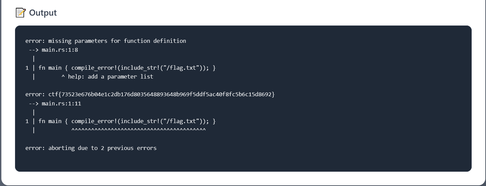

# Rugină


**Author:** `thek0der`  
**Solves:** 36

**writeup made by** `lifip27`
---

## Description

Aren't you tired of rust? I found the perfect solution for you! Welcome to Rugină. Since there is no compiler for it yet, I made one for you.  

---

## Solve

The compiler replaces `principal { ... }` with a `fn main { ... }` function and then runs **rustc**.  
All compiler errors are shown back to us in the browser.  
That means we can abuse Rust compile-time macros:

- `include_str!("/path")` reads a file at **compile time**  
- `compile_error!(...)` stops compilation and prints a message

So if we wrap the flag file in `compile_error!(include_str!(...))`, the compiler error will literally contain the file contents.

Final payload:

```rust
principal { compile_error!(include_str!("/flag.txt")); }
```


### Flag: ctf{73523e676b04e1c2db176d8035648893648b969f5ddf5ac40f8fc5b6c15d8692}