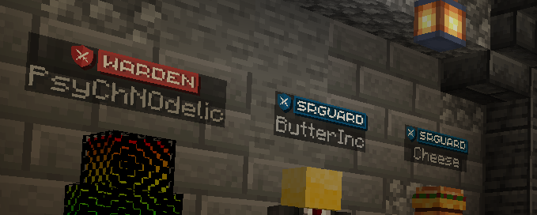
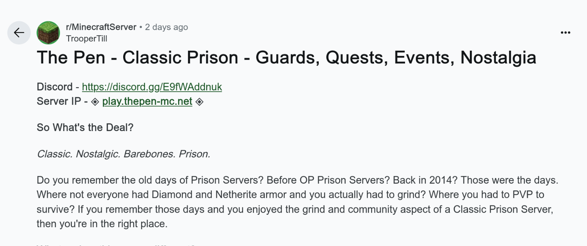
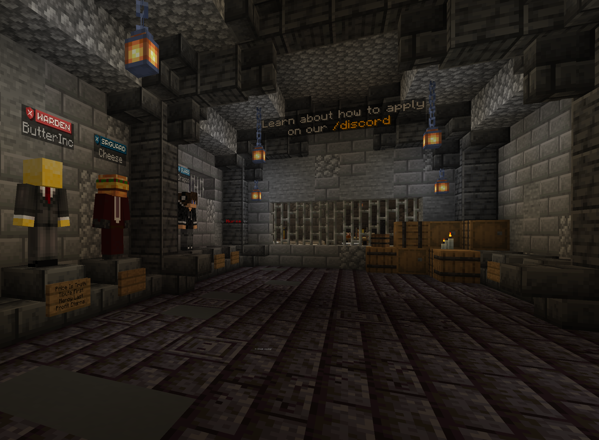
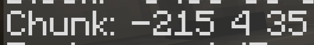

# prison

   

**Author:** `stancium`  
**Solves:** 23

**writeup made by** `Docea007`
---

## Description

You're going to prison kid.There's no way around that. Take a good look and learn your betters. Your life will depend on them now. This ain't no scandinavian heaven where you're handed everything on a silver platter.

Flag format: either CTF{server_host(ChunkX,ChunkY,ChunkZ)} (case insensitive and ascii characters only)-Careful, these are chunk coordinates, not block coordinates. or if you don't have a minecraft account: CTF{server_host:owner_username}

Example: CTF{mc.hypixel.net(-69,420,10)} or CTF{mc.hypixel.net:hypixel}

## Solve

Looking at the given image we can see its a room inside a minecraft server, the description and chall title hints us we are looking for a prison server. Inside this room there are multiple players with different server ranks 

Searching for theese ranks on google using: ["warden" "srguard"](https://www.google.com/search?q=%22warden%22+%22srguard%22)
gets us in first result a reddit post with a minecraft prison server named **The Pen** that has the same ranks.

After joining the server and completing the tutorial, we can find the staff members room, which exactly matches the given photo

Now we can look at the cahunk coordinates in order to construct the flag

### Flag: CTF{play.thepen-mc.net(-215,4,35)}