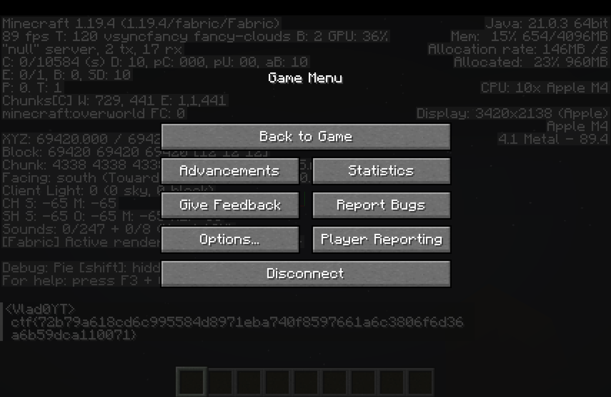

# Minecrafty


**Author:** `0v3rCl0kEd`  
**Solves:** 11

**writeup made by** `vlad`
---

## Description

Join my very own minecraft server and have some fun! Don't forget to visit our tourist spot to get your flag.

We get a `server.zip` archive with the server files.

---

## Solve

I opened the archive and had a look at the files and noticed in the folder game and the file chat.go i noticed this intresting snippet of code.

```go
switch string(message) {
		case "!flag":
			x := int32(player.Position[0])
			y := int32(player.Position[1])			
			z := int32(player.Position[2])
			
			if x != 69420 || y != 69420 || z != 69420 {		
				c.SendPlayerChat(
				player.UUID,
				0,
				signature,
				&sign.PackedMessageBody{
					PlainMsg: fmt.Sprintf("ctf{try_harder}  Your Position: %d %d %d  Expected Position: 69420 69420 69420", x, y, z),
					Timestamp: timestamp,
					Salt:      int64(salt),
					LastSeen:  []sign.PackedSignature{},
				},
				nil,
				&sign.FilterMask{Type: 0},
				&chatType,
				)
			} else {
				c.SendPlayerChat(
				player.UUID,
				0,
				signature,
				&sign.PackedMessageBody{
					PlainMsg: "ctf{redacted}",
					Timestamp: timestamp,
					Salt:      int64(salt),
					LastSeen:  []sign.PackedSignature{},
				},
				nil,
				&sign.FilterMask{Type: 0},
				&chatType,
				)
			}

		case "!help":
			c.SendPlayerChat(
			player.UUID,
			0,
			signature,
			&sign.PackedMessageBody{
				PlainMsg: fmt.Sprintf("!help to see this message; !flag for flag lolz"),
				Timestamp: timestamp,
				Salt:      int64(salt),
				LastSeen:  []sign.PackedSignature{},
			},
			nil,
			&sign.FilterMask{Type: 0},
			&chatType,
			)
	}
```

What this basically does is it defines 2 commands a player can run in chat: `!flag` and `!help`.
The one we are intrested in is the flag command and we can see that as long as we check all the conditions we will get the flag in the chat.
The condition is for all the coordinates x,y,z to be exactly `69420`.
Looking in `main.go` we also see `OnlineMode:           config.OnlineMode,` and other lines that strongly indicate that the server uses online authentication which means we must have a valid purchased minecraft account to join the server or at least a valid session to pass authentication.

First i had a look at `go-mc` which the server is written in and i tried to spoof my coordinates a few times using a real session from my account to authenticate but i didnt have much luck since i also found it hard to debug.

I then tried using a minecraft hack mod to be able to fly really fast there since i saw that we are spawned in creative when joining the world and can fly and after going there i and running the command i didnt get the correct flag but instead the server told me that im at arround 400 Y 400 meaning that the client mooved to fast and the server didnt register my movement packets.

Instead of trying to do that again manually i decided to make a minecraft mod of my own that does just that.

I cloned the base files for a fabric mod for github and setup these dependencies:

### gradle.properties
```properties
# Gradle
org.gradle.jvmargs=-Xmx1G
org.gradle.parallel=true

# Fabric Properties
minecraft_version=1.19.4
loader_version=0.14.21
loom_version=1.11-SNAPSHOT
yarn_mappings=1.19.4+build.2
# Mod Properties
mod_version=1.0.0
maven_group=com.example
archives_base_name=modid

# Dependencies
fabric_api_version=0.87.2+1.19.4
```

### build.gradle

```gradle
plugins {
	id 'fabric-loom' version "${loom_version}"
	id 'maven-publish'
}

version = project.mod_version
group = project.maven_group

base {
	archivesName = project.archives_base_name
}

repositories {
	// Add repositories to retrieve artifacts from in here.
	// You should only use this when depending on other mods because
	// Loom adds the essential maven repositories to download Minecraft and libraries from automatically.
	// See https://docs.gradle.org/current/userguide/declaring_repositories.html
	// for more information about repositories.
}

loom {

	mods {
		"coordspoof" {
			sourceSet sourceSets.main
		}
	}

}

dependencies {
    // Minecraft itself
    minecraft "com.mojang:minecraft:${project.minecraft_version}"

    // Use Yarn mappings (not Mojang!)
    mappings "net.fabricmc:yarn:${project.yarn_mappings}:v2"
	//mappings loom.officialMojangMappings()

    // Fabric loader
    modImplementation "net.fabricmc:fabric-loader:${project.loader_version}"

    // Fabric API
    modImplementation "net.fabricmc.fabric-api:fabric-api:${project.fabric_api_version}"
}

processResources {
	inputs.property "version", project.version

	filesMatching("fabric.mod.json") {
		expand "version": inputs.properties.version
	}
}

tasks.withType(JavaCompile).configureEach {
	it.options.release = 21
}

java {
	// Loom will automatically attach sourcesJar to a RemapSourcesJar task and to the "build" task
	// if it is present.
	// If you remove this line, sources will not be generated.
	withSourcesJar()

	sourceCompatibility = JavaVersion.VERSION_21
	targetCompatibility = JavaVersion.VERSION_21
}

jar {
	inputs.property "archivesName", project.base.archivesName

	from("LICENSE") {
		rename { "${it}_${inputs.properties.archivesName}"}
	}
}

// configure the maven publication
publishing {
	publications {
		create("mavenJava", MavenPublication) {
			artifactId = project.archives_base_name
			from components.java
		}
	}

	// See https://docs.gradle.org/current/userguide/publishing_maven.html for information on how to set up publishing.
	repositories {
		// Add repositories to publish to here.
		// Notice: This block does NOT have the same function as the block in the top level.
		// The repositories here will be used for publishing your artifact, not for
		// retrieving dependencies.
	}
}
```

### src/main/resources/fabric.mod.json

```json
{
  "schemaVersion": 1,
  "id": "coordspoof",
  "version": "1.0.0",
  "name": "Coord Spoof",
  "description": "Spoofs coords and sends !flag when pressing P",
  "authors": ["Vlad"],
  "entrypoints": {
    "client": [
      "me.vlad.coordspoof.CoordSpoof"
    ]
  },
  "depends": {
    "fabricloader": ">=0.14.21",
    "fabric": "*",
    "minecraft": "1.19.4"
  }
}
```

### src/main/java/me/vlad/coordspoof/CoordSpoof.java

```java
package me.vlad.coordspoof;

import net.fabricmc.api.ClientModInitializer;
import net.fabricmc.fabric.api.client.event.lifecycle.v1.ClientTickEvents;
import net.minecraft.client.MinecraftClient;
import net.minecraft.client.option.KeyBinding;
import net.minecraft.client.util.InputUtil;
import net.minecraft.network.packet.c2s.play.ChatMessageC2SPacket;
import net.minecraft.network.packet.c2s.play.PlayerMoveC2SPacket;
import net.minecraft.text.Text;
import org.lwjgl.glfw.GLFW;

public class CoordSpoof implements ClientModInitializer {
    private static KeyBinding spoofKey;
    private static boolean spoofing = false;

    // Target
    private static final double TARGET_X = 69420.0;
    private static final double TARGET_Y = 69420.0;
    private static final double TARGET_Z = 69420.0;
    private static double currentX, currentY, currentZ;
    private static final double STEP = 5; // steps per tick

    @Override
    public void onInitializeClient() {
        spoofKey = new KeyBinding(
                "key.coordspoof.spoof",
                InputUtil.Type.KEYSYM,
                GLFW.GLFW_KEY_O,
                "category.coordspoof"
        );

        ClientTickEvents.END_CLIENT_TICK.register(client -> {
            if (spoofKey.wasPressed()) {
                if (client.player != null) {
                    currentX = client.player.getX();
                    currentY = client.player.getY();
                    currentZ = client.player.getZ();
                    spoofing = true;
                    client.player.sendMessage(Text.of("[CoordSpoof] Starting spoof-flight..."), false);
                }
            }

            if (spoofing && client.player != null && client.getNetworkHandler() != null) {
                if (!moveStep(client)) {
                    spoofing = false;
                    System.out.println("[CoordSpoof] Arrived at target");
                }
            }
        });
    }

    private boolean moveStep(MinecraftClient client) {
        boolean moved = false;

        if (Math.abs(currentX - TARGET_X) > STEP) {
            currentX += (currentX < TARGET_X ? STEP : -STEP);
            moved = true;
        } else {
            currentX = TARGET_X;
        }

        if (Math.abs(currentY - TARGET_Y) > STEP) {
            currentY += (currentY < TARGET_Y ? STEP : -STEP);
            moved = true;
        } else {
            currentY = TARGET_Y;
        }

        if (Math.abs(currentZ - TARGET_Z) > STEP) {
            currentZ += (currentZ < TARGET_Z ? STEP : -STEP);
            moved = true;
        } else {
            currentZ = TARGET_Z;
        }

        client.getNetworkHandler().sendPacket(
                new PlayerMoveC2SPacket.PositionAndOnGround(currentX, currentY, currentZ, true)
        );

        client.execute(() -> {
            if (client.player != null) {
                client.player.updatePosition(currentX, currentY, currentZ);
            }
        });

        System.out.println("Spoof step: " + currentX + ", " + currentY + ", " + currentZ);
        return !(currentX == TARGET_X && currentY == TARGET_Y && currentZ == TARGET_Z);
    }
}
```

I will now explain what the code does.

We first import everything we need for running on the client, running every tick, access to the player, key binds, playermove pakcets, chat message(that i didnt end up using will explain later), text for debug and GLFW for key constants

We then define a few simple variables like if the script is active the target coordinates, our current ones and how much it should move per tick(needs to be adjusted so packets are accepted by server and not dropped).

We then initialize the mod on the client defining the key `O` for the mod trigger which starts spoofing movement.

Once spoofing is active the script will call moveStep each tick until target is reached.

moveStep is pretty simple all it does is that take the current coordinates and adds step to them and sends the movement packet while also printing a debug message to the console(not chat). After the first try i realised that i also needed to call `updatePosition` or else the client wouldnt move and the fake packets would conflict with the spoofed one and it wouldnt work.

If its still mooving it returns true if finished false. We know we are finished when the current coordinates are maximum one step away from the target ones.

After its done we can just type `!flag` manually and get the flag. I tried making chat debug or make it type !flag by itself but in the new versions of minecraft they added some new encryption which makes it much more difficult and i didnt see any point in spending so much time for it.

After we compile everything with `./gradlew clean build` we get in `./builds/libs/` the file `modid-1.0.0.jar` which we can add to our fabric `1.19.4` client with fabric api installed, join the server and press O and while its running press the spacebar twice fast so we are "flying" which will cause our character to not fall down once its finished. Now we wait arround 10-15 minutes while its running in this time we can do something else and once its done we see that we are at 69420 on all axis and upon running `!flag` we get the flag as seen in the screenshot.

I honestly really loved this challenge and i hope to see more like this in the future.



### Flag: ctf{72b79a618cd6c995584d8971eba740f8597661a6c3806f6d36a6b59dca110071}