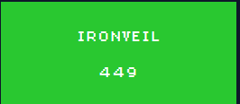

# Ironveil



**Author:** `thek0der`  
**Solves:** 10

**writeup made by** `lifip27`
---

## Description

Someone encrypted my files using this... including the flag. I want it back!

We get: `Flag.txt.encrypted` AND `ironveil` (`ìronveil_old`)
---

I want to make a statement, my solve is not the intended solution!!

## Analyzing

First lets try to run the file

```bash
$ ./ironveil
-bash: ./ironveil: cannot execute: required file not found
```

Okay so the binary needs a file to run, lets try to run with the `flag.txt.encrypted`

```bash
./ironveil flag.txt.encrypted
-bash: ./ironveil: cannot execute: required file not found
```

Still is not running that's means that it maybe has a needed loader.   

Lets see what kind of file the binary is:
```bash
$ file ironveil
ironveil: ELF 64-bit LSB pie executable, x86-64, version 1 (SYSV), dynamically linked, interpreter /nix/store/q4wq65gl3r8fy746v9bbwgx4gzn0r2kl-glibc-2.40-66/lib/ld-linux-x86-64.so.2, for GNU/Linux 3.10.0, stripped
```

Here we can see this particular string **/nix/store/q4wq65gl3r8fy746v9bbwgx4gzn0r2kl-glibc-2.40-66/lib/ld-linux-x86-64.so.2**.   

The loader for this binary is: **/lib64/ld-linux-x86-64.so.2**

Let's try to run it:
```bash
$ /lib64/ld-linux-x86-64.so.2 ./ironveil
Usage: ./ironveil <file_to_encrypt>
```

Alright so it ask for a file to **ENCRYPT**.

## Solve

Because I was lazy to try another file I just encrypted the flag.txt.encrypted to test the algorithm.

```bash
$ /lib64/ld-linux-x86-64.so.2 ./ironveil flag.txt.encrypted
File encrypted successfully: flag.txt.encrypted.encrypted
Key derived using VM program with 32 opcodes
```

Doing strings on the file `flag.txt.encrypted.encrypted``:

```bash
$ cat flag.txt.encrypted.encrypted
ctf{72639ac8d2397ab23d51fc82ca0ce8fb57582a92348cadb1a2430d7f3d43bd1b}b��_tg�t��ιsx�7~�Â���e��އ�
```

We get the flag unintended!

### Flag: ctf{72639ac8d2397ab23d51fc82ca0ce8fb57582a92348cadb1a2430d7f3d43bd1b}


`thek0der` it happens to the best of us!