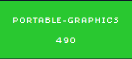
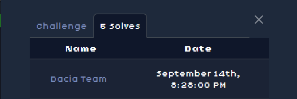
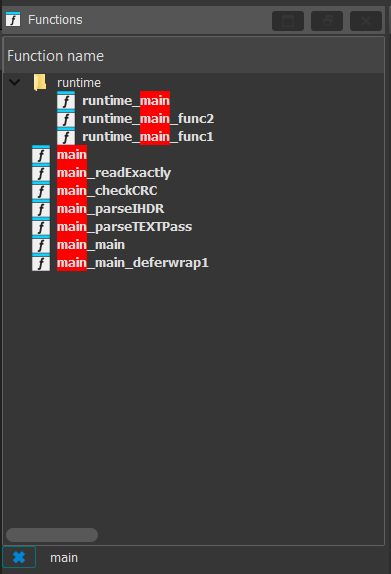
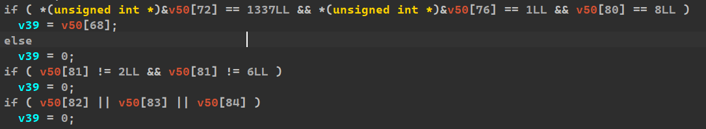
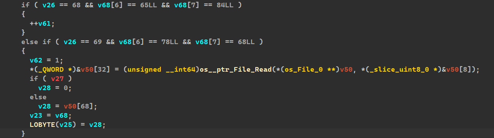
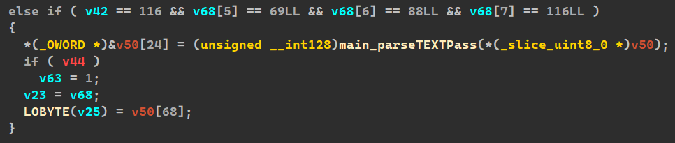
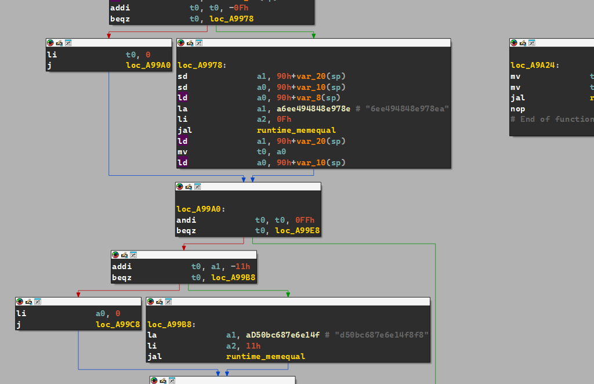
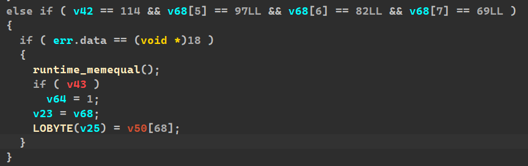
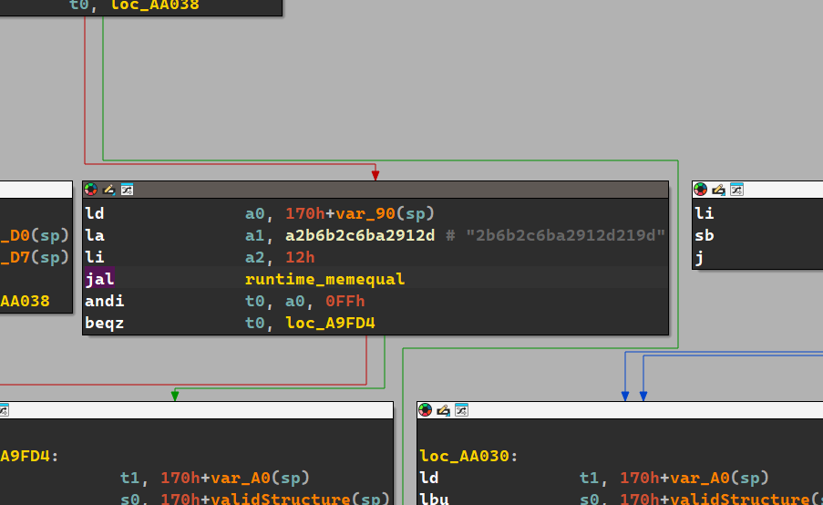

# portable-graphics

   


**Author:** `thek0der`  
**Solves:** 5

---

## Description

We love our graphics to be portable! If you can abide our rules, we might give you the flag...   

We get THE `challenge` BINARY
---

## Recon (yet again)

We start by opening ida and importing the binary!

I recommend when doing reverse sometimes to filter the functions that are related to `main`!   
For example:



Lets start looking at main!

We can find this!   

```c
main_readExactly(*(io_Reader_0 *)v50, *(int *)&v50[16]);
  if ( v5 )
  {
    v6 = 0;
  }
  else
  {
    if ( v4 == main_pngSig.len )
      runtime_memequal();
    else
      v7 = 0;
    v6 = v7 != 0LL;
  }
  v50[69] = v6;
```

This means that some PNG signature must match
lets try to connect to the server
Im just gonna use a test.png photo dosent really matter
```bash
$ nc -q 1 ctf.ac.upt.ro 9330 < test.png
Please upload your file (raw):
Nope!
```

## Solve

Let's look inside the code to see what kind of png does it want!
We can fine some interesting stuff like:

the IHDR parsing block:
```c
else if ( v26 == 72 && v68[6] == 68LL && v68[7] == 82LL ) // 'IDHR'
      {
        if ( v22 )
          v25 = 0LL; // invalidate if IHDR not first
          ...
          v66 = 1;
          if ( *(unsigned int *)&v50[72] == 1337LL && *(unsigned int *)&v50[76] == 1LL && v50[80] == 8LL )
            v39 = v50[68];
          else
            v39 = 0;
          if ( v50[81] != 2LL && v50[81] != 6LL )
            v39 = 0;
          if ( v50[82] || v50[83] || v50[84] )
            v39 = 0;
        }
```

**If you want more details about IHDR check out this page https://www.libpng.org/pub/png/spec/1.2/PNG-Chunks.html**
This tells us the IHDR chunk must be the very first one!   
Scrolling down we can find each test!



Which means:
```bash
Width = 1337
Height = 1
Bit depth = 8
Color type = 2 (RGB) or 6 (RGBA)
Compression, filter, interlace = 0
```

Still in `main.main` we can find this



Which means:
We must include at least one IDAT.
We must include an IEND chunk.
After IEND there can be no trailing bytes.

After searching around we find this calls:   


And going in `main.parseTEXTPass` we can clearly see the bytes:



readable:
```c
if ( v17 == 15 )
{
  la  a1, "6ee494848e978ea"
  li  a2, 0Fh
  jal runtime_memequal
}
...
if ( v6 == 17 )
{
  la  a1, "d50bc687e6e14f8f8"
  li  a2, 11h
  jal runtime_memequal
}
```

So The `tEXt` payload must be:
```bash
"6ee494848e978ea" + \x00 + "d50bc687e6e14f8f8"
```

After this we need to find the raRE chunk!   
 


Pressing tab to see the value is:



Readable:
```c
la  a1, "2b6b2c6ba2912d219d"
li  a2, 12h    # 18
```

We must include a custom chunk `raRE` with exactly 18 bytes, and the payload must equal `"2b6b2c6ba2912d219d"`.

And now using the `solve.py` to create the PNG with the constant values we can grab the flag!

```bash
$ python3 makepng.py
built pass.png
```

```bash
$ nc -q 1 ctf.ac.upt.ro 9330 < pass.png
Please upload your file (raw):
ctf{4519435858447654fa9eb22e9aa1f916c7a9e35873ac062b849acde073f71e2b}
```

There is our flag!

### Flag: ctf{4519435858447654fa9eb22e9aa1f916c7a9e35873ac062b849acde073f71e2b}