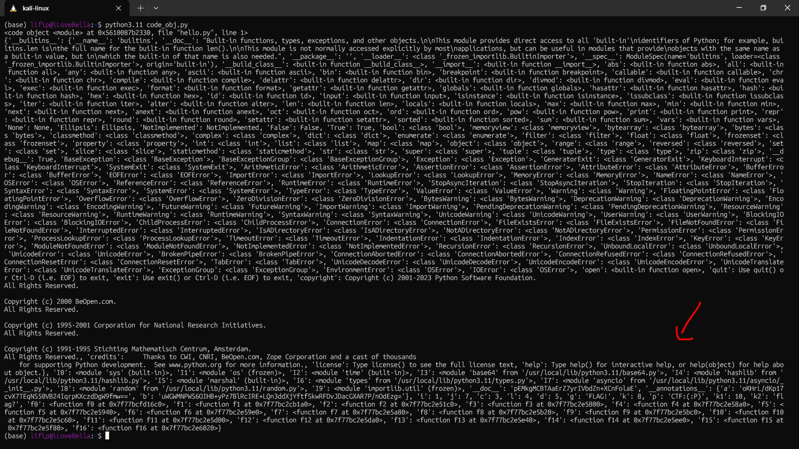

# Pythonese


**Author:** `stancium`  
**Solves:** 27

---

## Description

Wait, this language compiles ?...

We get: `bytecode.pyc`
---


## Analyzing

We can try to use Pylingual but it doesnt work (we will learn later why)

So from experience of other ctfs lets use **marshal** to import the .pyc and read from it

```python
import marshal, sys
data = open("bytecode.pyc","rb").read()
code = marshal.loads(data[16:])
print(code)
ns = {}
exec(code, ns, ns)
print(ns)
```

VERY BAD PYTHON SCRIPT BUT I WAS DOING IT FAST FOR THE SAKE OF THE FLAG

if we run this we with lastest python
```bash
$ python3 code_obj.py
<code object <module> at 0x556796faf170, file "hello.py", line 1>
Segmentation fault (core dumped)
```

It segmentation faults so we need to check which python version it is!

```bash
$ file bytecode.pyc
bytecode.pyc: Byte-compiled Python module for CPython 3.11 (magic: 3495), timestamp-based, .py timestamp: Tue Sep  9 19:54:47 2025 UTC, .py size: 6221 bytes
```

**Python 3.11**!



That is the import stuff. The functions names!

Something fishy I can see is this part:
```python
'__doc__': 'pEMkgMCBTAaErZ7yrIVbdZn+XCnFolaE', '__annotations__': {'a': 'oKHrL/dKp17cvX7TEqNS50VB24IqrpKXczdDgW9fmw==', 'b': 'uWGWMNPWS6OIHB+yPz7BlRcIRE+LQn3ddXjYftfSkwRFDvJDacGXAR7P/nOdEzg='}, 'i': 1, 'j': 7, 'c': 3, 'l': 4, 'd': 5, 'g': 'FLAG!', 'k': 8, 'p': 'CTF:(:P)', 'k1': 10, 'k2': 'flag?',
```

For the second script I wanted to read every functions name so I vibe coded `decompiling.py`

```bash
$ python3.11 decompiling.py bytecode.pyc
Wrote: decompiled_funcs/f0.txt
Wrote: decompiled_funcs/f1.txt
Wrote: decompiled_funcs/f10.txt
Wrote: decompiled_funcs/f11.txt
Wrote: decompiled_funcs/f12.txt
Wrote: decompiled_funcs/f13.txt
Wrote: decompiled_funcs/f14.txt
Wrote: decompiled_funcs/f15.txt
Wrote: decompiled_funcs/f16.txt
Wrote: decompiled_funcs/f2.txt
Wrote: decompiled_funcs/f3.txt
Wrote: decompiled_funcs/f4.txt
Wrote: decompiled_funcs/f5.txt
Wrote: decompiled_funcs/f6.txt
Wrote: decompiled_funcs/f7.txt
Wrote: decompiled_funcs/f8.txt
Wrote: decompiled_funcs/f9.txt

Done. Check the 'decompiled_funcs' directory for per-function .txt files.
```

Know I did some *munca de batran chinez* (my romanian people will understand it) and just looked through each one.   
The `f0` is an anti-debug / anti-decompile check:

```bash
=== DISASSEMBLY ===
 10           0 RESUME                   0

 11           2 LOAD_CONST               1 (('pylingual', 'decompyle3', 'uncompyle6', 'pycdc', 'pydevd'))
              4 GET_ITER
        >>    6 FOR_ITER                42 (to 92)
              8 STORE_FAST               0 (m)

 12          10 NOP

 13          12 LOAD_GLOBAL              1 (NULL + I9)
             24 LOAD_ATTR                1 (find_spec)
             34 LOAD_FAST                0 (m)
             36 PRECALL                  1
             40 CALL                     1
             50 POP_JUMP_FORWARD_IF_NONE     3 (to 58)

 14          52 POP_TOP
             54 LOAD_CONST               2 (True)
             56 RETURN_VALUE

 13     >>   58 JUMP_BACKWARD           27 (to 6)
        >>   60 PUSH_EXC_INFO

 15          62 LOAD_GLOBAL              4 (Exception)
             74 CHECK_EXC_MATCH
             76 POP_JUMP_FORWARD_IF_FALSE     3 (to 84)
             78 POP_TOP

 16          80 POP_EXCEPT
             82 JUMP_BACKWARD           39 (to 6)

 15     >>   84 RERAISE                  0
        >>   86 COPY                     3
             88 POP_EXCEPT
             90 RERAISE                  1

 17     >>   92 LOAD_GLOBAL              7 (NULL + I0)
            104 LOAD_ATTR                4 (gettrace)
            114 PRECALL                  0
            118 CALL                     0
            128 LOAD_CONST               0 (None)
            130 IS_OP                    1
            132 RETURN_VALUE
```

What it did exactly was checking for debuggers and if there was a debugger. `f0` turns true.
From the `f16` disasembly:
```bash
114  LOAD_GLOBAL f0
130  CALL 0
140  POP_JUMP_FORWARD_IF_FALSE 35 (to 212)
142  LOAD_GLOBAL print
154  LOAD_GLOBAL f14
166  LOAD_GLOBAL i
182  CALL 1           
196  CALL 1           
208  RETURN_VALUE     
```

Readable:

```python
if f0():            # anti-debug/decompile detected
    print(f14(i))   # print decoy
    return
```

What gets printed when no decoy?
In `f16` after the anti-analysis breach we have this interested thing:
```bash
1040 LOAD_GLOBAL f15
1068 CALL 1          # (b, ok) = f15(i)
...
1088 boot['main'](b) -> run
...
print( run(bytes(mip)) )
```
`f15(i)` returns a marshalled code blob b and a boolean ok.

`boot["main"](b)` turns that blob into a real python function called run.

They call `run(bytes(mip))` and print whatever it returns.

Let's check on boot['main'] from f11.
```python
import marshal
def boot(b):
    c = marshal.loads(b)
    g = {}
    exec(c, g)
    return g['run']
def main(x):
    return boot(x)
```

So `boot['main'](b)` literally unmarshals a code object that contains a function run, executes it into a dict, and returns that run.

Next we need to look at `f15`:
```bash
LOAD_GLOBAL f12
LOAD_CONST '' ; LOAD_METHOD join
LOAD_GLOBAL i ; SLICE [:5]
LOAD_GLOBAL i ; SLICE [5:]
BUILD_LIST 2 ; CALL join
CALL f12
POP_JUMP_FORWARD_IF_FALSE 111 (to 348)
```

is this:
```python
if f12("".join([i[:5], i[5:]])):
```

`f15` calls `f12(i)`; if it’s False you get the decoy. Show readers the exact check:
```python
import base64, hashlib
s = base64.b64decode(base64.b64encode(bytes.fromhex("736861323536"))).decode()
target = "".join([
 "0","2","e","e","5","f","3","7","b","7","2","8","4","f","a","3",
 "8","5","a","3","8","0","3","9","7","5","d","3","d","b","f","1",
 "8","9","7","3","c","2","1","e","5","b","a","f","d","6","3","f",
 "0","a","e","1","e","2","1","d","1","6","c","2","9","7","7","9"
])
print(s, target)
```
finding i with that exact SHA-256 is a preimage attack. we are not doing this at runtime!

The creator is very 👾👾👾!

### INSIDE f13

Inside `f13` we can find some encoded chunks:
```bash
=== Integer tuples found (useful arrays) ===
CONST_INDEX 2: [382, 356, 392, 430]
CONST_INDEX 3: [442, 544, 456, 552, 544, 538, 540, 446]
CONST_INDEX 4: [546, 548, 556, 446, 442, 556, 442, 448]
CONST_INDEX 5: [540, 542, 452, 544, 456, 546, 448, 456]
CONST_INDEX 6: [446, 540, 456, 548, 540, 538, 442, 546]
CONST_INDEX 7: [544, 554, 548, 548, 446, 450, 446, 540]
CONST_INDEX 9: [554, 538, 544, 448, 548, 554, 542, 452]
CONST_INDEX 10: [456, 442, 546, 542, 556, 554, 542, 542]
CONST_INDEX 11: [544, 550, 554, 456, 448, 456, 446, 556]
CONST_INDEX 13: [3, 6, 1, 7, 0, 5, 2, 4]
```

the decoder in `f13`:
Lines 0–16 create `fvdy` with a closure capturing `k1` and `k2`:
```bash
6  LOAD_CLOSURE k1
8  LOAD_CLOSURE k2
12 LOAD_CONST <code object fvdy>
14 MAKE_FUNCTION 8 (closure)
16 STORE_FAST fvdy
```
===> `fvdy = "".join(chr((((v>>1)-k2) ^ (k1 & 0xFF)) & 0xFF) for v in arr)` look under!
```bash
14 LOAD_GLOBAL chr
26 LOAD_FAST  v
28 LOAD_CONST 1
30 BINARY_OP >>          # v >> 1
34 LOAD_DEREF k2
36 BINARY_OP -           # (v >> 1) - k2
40 LOAD_DEREF k1
42 LOAD_CONST 255
44 BINARY_OP &           # (k1 & 0xFF)
48 BINARY_OP ^           # ^ (k1 & 0xFF)
52 LOAD_CONST 255
54 BINARY_OP &           # & 0xFF
58 PRECALL 1
62 CALL 1                # chr(...)
72 YIELD_VALUE           # yield each decoded char
```
And the outer `fvdy` joins those chars (your **fvdy** block):
```bash
4  LOAD_CONST '' ; LOAD_METHOD join
34 LOAD_CONST <genexpr> ; MAKE_FUNCTION 8 (closure k1,k2)
38 LOAD_FAST arr ; GET_ITER ; CALL 0
56 PRECALL 1 ; CALL 1      # ''.join(genexpr(...))
70 RETURN_VALUE
```
Lines **18–196**, **198–274** repeatedly call `fvdy([...])` and store the results in globals:
```bash
A: 20 LOAD_FAST fvdy ; ... ; LOAD_CONST (382,356,392,430) ; CALL 1 ; STORE_GLOBAL a
B: 46 LOAD_FAST fvdy ; ... ; LOAD_CONST (442,544,...)     ; CALL 1 ; STORE_GLOBAL b
G: 72 ... STORE_GLOBAL g
E: 98 ... STORE_GLOBAL e
D: 124 ... STORE_GLOBAL d
F: 150 ... STORE_GLOBAL f
J: 176 ... LOAD_CONST 434 ... STORE_GLOBAL j
C: 200 ... STORE_GLOBAL c
H: 226 ... STORE_GLOBAL h
I: 252 ... STORE_GLOBAL i
```
So after this step you have **10** decoded strings: `a,b,c,d,e,f,g,h,i,j`.

Line **276–374** builds L:
```bash
276 LOAD_GLOBAL b, c, d, e, f, g, h, i
372 BUILD_LIST 8
374 STORE_GLOBAL L
```

Lines **376–408** reverse each string in `L` via a listcomp (note the `[::-1]` slice):
```bash
# listcomp:
10 LOAD_FAST s
12 LOAD_CONST None ; 14 LOAD_CONST None ; 16 LOAD_CONST -1
18 BUILD_SLICE 3
20 BINARY_SUBSCR            # s[::-1]
30 LIST_APPEND
```

Lines **410–416** set the permutation:
```bash
410 BUILD_LIST 0
412 LOAD_CONST (3,6,1,7,0,5,2,4)
416 STORE_GLOBAL P
```
Lines **430–522**: apply permutation: `for k, v in enumerate(P): R[v] = L[k]`:
```bash
430 LOAD_GLOBAL enumerate(P) ; GET_ITER
470 FOR_ITER ...
476 STORE_FAST k ; 478 STORE_FAST v
480 LOAD_GLOBAL L ; 492 LOAD_FAST k ; BINARY_SUBSCR    # L[k]
504 LOAD_GLOBAL R ; 516 LOAD_FAST v ; STORE_SUBSCR      # R[v] = L[k]
```
Lines **524–594**: reverse each again and join: `u = ''.join(s[::-1] for s in R)`:
```bash
524 LOAD_CONST '' ; LOAD_METHOD join
548 LOAD_CONST <genexpr> ; MAKE_FUNCTION 0
552 LOAD_GLOBAL R ; GET_ITER ; CALL 0
580 PRECALL 1 ; CALL 1
594 STORE_FAST u
# genexpr does s[::-1] again:
12 LOAD_FAST s
14 LOAD_CONST None ; 16 None ; 18 -1 ; 20 BUILD_SLICE ; 22 BINARY_SUBSCR
32 YIELD_VALUE
```

Lines **596–630**: return a + u + j: 
```bash
596 LOAD_GLOBAL a
608 LOAD_FAST u
610 BINARY_OP +          # a + u
614 LOAD_GLOBAL j
626 BINARY_OP +          # (a + u) + j
630 RETURN_VALUE
```

Now we need to recover the tiny keys, using this script!
Use the first **4** numbers to brute-force `(t, k2)` where `t = k1 & 0xFF` and `k2` is two digits `(int(i[4:6]))`:
```python
a_arr = [382,356,392,430]
bases = [v>>1 for v in a_arr]
want  = list(map(ord,"CTF{"))
sol=[]
for t in range(256):
    for k2 in range(100):
        if all((((bb-k2)^t)&0xFF)==ww for bb,ww in zip(bases,want)):
            sol.append((t,k2))
print(sol)
```

```bash
$ python3 1.py
[(209, 45)]
```

So `k1 & 0xFF = 209`, `k2 = 45`.

What we know!

We recovered the keys:` t = (k1 & 0xFF) = 209` and `k2 = 45`.
`fvdy` (from `f13`) decodes one chunk:
```python
fvdy(arr) = "".join(chr((((v >> 1) - k2) ^ t) & 0xFF) for v in arr)
```

`f13` then:
1. decodes **10** arrays → names `A,B,C,D,E,F,G,H,I,J`
2. builds `L = [B,C,D,E,F,G,H,I]`, reverses each string in L
3. permutes with `P = [3,6,1,7,0,5,2,4]` via `R[P[k]] = L[k]`
4. reverses each `R[i]` again and concatenates
5. returns `A + u + J`

So the middle chunks are reordered to: `[F, D, H, B, I, G, C, E]` (the two reversals cancel orientation; they only *obfuscate* the order).

## Computing the flag!

```python
def fvdy(arr, t, k2):
    return "".join(chr((((v>>1)-k2) ^ t) & 0xFF) for v in arr)

t, k2 = 209, 45
A=[382,356,392,430]; B=[442,544,456,552,544,538,540,446]
G=[546,548,556,446,442,556,442,448]; E=[540,542,452,544,456,546,448,456]
D=[446,540,456,548,540,538,442,546]; F=[544,554,548,548,446,450,446,540]
J=[434]; C=[554,538,544,448,548,554,542,452]
H=[456,442,546,542,556,554,542,542]; I=[544,550,554,456,448,456,446,556]
P=[3,6,1,7,0,5,2,4]

a = fvdy(A,t,k2); b=fvdy(B,t,k2); c=fvdy(C,t,k2); d=fvdy(D,t,k2)
e=fvdy(E,t,k2); f=fvdy(F,t,k2); g=fvdy(G,t,k2); h=fvdy(H,t,k2); i=fvdy(I,t,k2); j=fvdy(J,t,k2)

L=[b,c,d,e,f,g,h,i]; L=[s[::-1] for s in L]
R=[""]*8
for k,v in enumerate(P):
    R[v]=L[k]
u="".join(s[::-1] for s in R)
flag=a+u+j
print(flag)
```

Running the *script*

```bash
$ python3 flag.py
CTF{2944cec0c0f401a5fa538933a2f6210c279fbfc8548ca8ab912b493d03d2f5bf}
```

VERY COOL CHALLENGE LOVED IT!!! KUDOS TO `stancium`!

